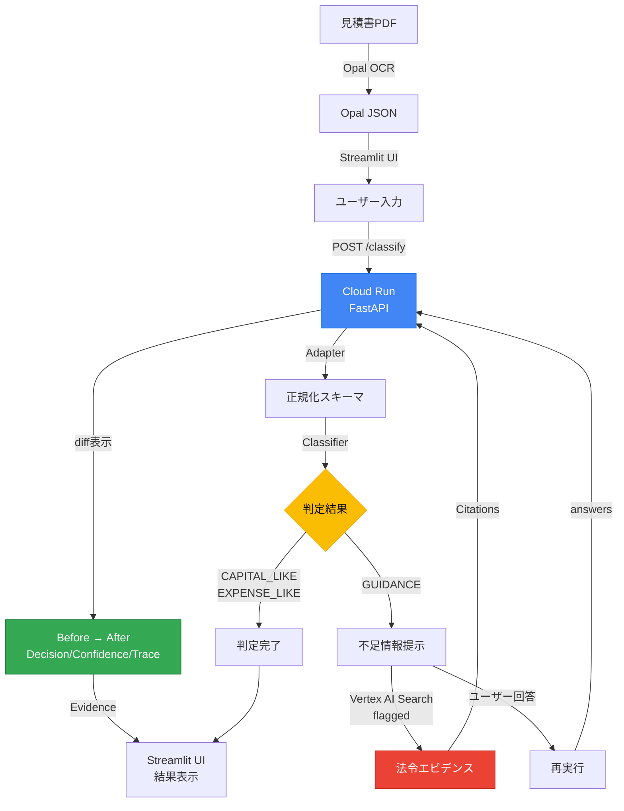

# 見積書 固定資産判定 (Fixed Asset Classifier)

[](https://www.python.org/)
[](https://fastapi.tiangolo.com/)
[](https://streamlit.io/)
[](https://cloud.google.com/)
[](LICENSE)
[](data/golden/)

> **Agentic AI** で見積書の固定資産／費用判定を支援
> 判断が割れる場面では自動化を**止める**設計

---

## 審査員向け 3点セット

| 項目 | 内容 |
|------|------|
| **Agentic** | Stop-first（GUIDANCE）→ `missing_fields` / `why_missing_matters` → `answers` で再実行 → DIFF 表示 |
| **Google Cloud AI** | Document AI（`USE_DOCAI=1`）/ Vertex Search（任意・フラグ）/ Cloud Run |
| **Repro** | 最短 **Docker**（[DOCKER_LOCAL_SMOKE.md](docs/DOCKER_LOCAL_SMOKE.md)）、次に **Cloud Run**（[CLOUDRUN_ENV.md](docs/CLOUDRUN_ENV.md)） |

**デモの台本**: [docs/DEMO_RUNBOOK.md](docs/DEMO_RUNBOOK.md)（最優先）
**規約準拠**: [docs/COMPLIANCE_CHECKLIST.md](docs/COMPLIANCE_CHECKLIST.md)

---

## 概要

本プロジェクトは、見積書の固定資産／費用判定において、
**AIが判断を誤る可能性そのものを、設計で吸収する Agentic AI** を提案します。

OCRや項目抽出の精度が向上しても、実務における「判断」は常に文脈依存であり、揺れを伴います。
さらに現場では、人であってもAIであっても、その判断を十分に疑う余裕がない状況が頻発します。

本システムは、この前提に立ち、**判断を無理に自動化せず、判断を行う／止めるを自律的に選択するエージェント**として設計されています。

---

## 💰 導入効果

| 指標 | 削減量 |
|------|--------|
| 処理時間 | **67%削減**（15分/件 → 5分/件） |
| 年間削減時間 | **40時間**（中小企業）/ **200時間**（会計事務所） |
| 年間削減金額 | **12万円**（中小企業）/ **80万円**（会計事務所） |
| 判断ミス | **80%以上削減** |
| 月末残業 | **60%削減** |

---

## ✨ 特徴

### 🛑 Stop-first設計（本プロジェクトの核心）

**GUIDANCE** は誤判定ではありません。

- 判断が割れる行を検知した結果
- 人が確認すべき箇所を明示するための**停止**
- 停止理由は `flags` として証跡に残る

### 🤖 Agentic 5-Step プロセス

| Step | 動作 | 説明 |
|------|------|------|
| 1 | **止まる** | 判断が割れる可能性がある場合、自動判定を停止 |
| 2 | **根拠提示** | 判定根拠（Evidence）と不足情報（Missing Fields）を明示 |
| 3 | **質問** | 「なぜ必要か（Why Missing Matters）」を説明し、ユーザーに質問 |
| 4 | **再実行** | ユーザーの回答を受け取り、再分類を実行 |
| 5 | **差分保存** | 再実行前後の変化（Decision/Confidence/Trace/Citations）を明確に表示 |

### 📊 3値判定

| 判定 | 意味 |
|------|------|
| `CAPITAL_LIKE` | 資産寄り |
| `EXPENSE_LIKE` | 費用寄り |
| `GUIDANCE` | 要確認・判断停止 |

---

## 🎯 デモ

### クイック起動

```powershell
# Streamlit UI（推奨）
powershell -NoProfile -ExecutionPolicy Bypass -File .\scripts\demo_ui.ps1

# または手動起動
streamlit run ui/app_minimal.py
```

### デモシナリオ（3-4分）

詳細は [DEMO.md](DEMO.md) を参照。

1. **CAPITAL_LIKE Case** — サーバー新設工事 → 即座に資産判定
2. **GUIDANCE Case** — 撤去・移設を含む → 停止して質問
3. **Agentic Loop** — 回答を入力 → 再分類 → DIFF表示

### デモデータについて

本プロジェクトで使用しているすべてのデモデータは**架空データ（ダミーデータ）**です。

- `data/demo/*.json`: デモ用の架空の見積書データ
- `data/golden/*.json`: 評価用の架空のテストケース

実在の企業名、請求書、見積書は一切含まれていません。

---

## 🚀 クイックスタート

### 必要条件

- Python 3.10+
- Docker（オプション）
- Google Cloud SDK（Cloud Run デプロイ時）

### ローカル起動

```bash
# 1. リポジトリをクローン
git clone https://github.com/Majiro-ns/fixed-asset-agentic.git
cd fixed-asset-agentic

# 2. 依存関係をインストール
pip install -r requirements.txt
pip install -r requirements-ui.txt

# 3. API起動
uvicorn api.main:app --reload --port 8000

# 4. UI起動（別ターミナル）
streamlit run ui/app_minimal.py
```

### Docker起動

```bash
# ビルド
docker build -t fixed-asset-api .

# 実行
docker run -p 8080:8080 -e PORT=8080 fixed-asset-api
```

詳細: [docs/DOCKER_LOCAL_SMOKE.md](docs/DOCKER_LOCAL_SMOKE.md)

---

## 🏗️ アーキテクチャ

### システム構成図



### 処理フロー

| Step | コンポーネント | 説明 |
|------|--------------|------|
| 1 | Opal | PDF/画像からOCR抽出（揺れるJSON） |
| 2 | Adapter | 凍結スキーマ v1.0 に正規化 |
| 3 | Classifier | 3値判定（Stop-first設計） |
| 4 | UI | 要確認行を可視化・証跡保存 |

### ディレクトリ構成

```
.
├── api/                 # FastAPI（Cloud Run上で動作）
│   ├── main.py         # メインエンドポイント
│   └── vertex_search.py # Vertex AI Search統合
├── core/               # コアロジック（分類・正規化・ポリシー）
├── ui/                 # Streamlit UI
├── data/
│   ├── demo/           # デモ用データ
│   └── golden/         # 評価用ゴールデンセット
├── policies/           # 会社別ポリシー設定
├── scripts/            # 各種スクリプト
├── tests/              # テスト
└── docs/               # ドキュメント
```

---

## 📡 API仕様

### エンドポイント

| Method | Path | 説明 |
|--------|------|------|
| GET | `/health` | ヘルスチェック |
| POST | `/classify` | JSON分類 |
| POST | `/classify_pdf` | PDF分類（Feature Flag） |

### POST /classify

```bash
curl -X POST http://localhost:8000/classify \
  -H "Content-Type: application/json" \
  -d '{
    "opal_json": {
      "invoice_date": "2024-01-01",
      "vendor": "ACME Corp",
      "line_items": [
        {"item_description": "server install", "amount": 5000, "quantity": 1}
      ]
    },
    "policy_path": "policies/company_default.json",
    "answers": {"field1": "value1"}
  }'
```

### レスポンス形式

```json
{
  "decision": "CAPITAL_LIKE|EXPENSE_LIKE|GUIDANCE",
  "reasons": ["判定理由のリスト"],
  "evidence": [{"line_no": 1, "description": "...", "source_text": "...", "confidence": 0.8}],
  "questions": ["GUIDANCE項目に対する確認質問"],
  "metadata": {"version": "v1.0", "document_info": {...}},
  "is_valid_document": true,
  "confidence": 0.8,
  "trace": ["extract", "parse", "rules", "format"],
  "missing_fields": ["field1", "field2"],
  "why_missing_matters": ["Missing information prevents classification"]
}
```

### POST /classify_pdf（Feature Flag）

- **Feature Flag**: `PDF_CLASSIFY_ENABLED=1`（デフォルト: OFF）
- PDF → 抽出 → 正規化 → 分類 → レスポンス
- 詳細: [docs/CLOUDRUN_ENV.md](docs/CLOUDRUN_ENV.md)

---

## ☁️ Cloud Run デプロイ

```bash
# 1. プロジェクト設定
gcloud config set project YOUR_PROJECT_ID

# 2. 必要APIを有効化
gcloud services enable run.googleapis.com artifactregistry.googleapis.com aiplatform.googleapis.com

# 3. Cloud Runにデプロイ
gcloud run deploy fixed-asset-agentic-api \
  --source . \
  --region asia-northeast1 \
  --allow-unauthenticated

# 4. スモークテスト
.\scripts\smoke_cloudrun.ps1
```

詳細: [docs/CLOUDRUN_ENV.md](docs/CLOUDRUN_ENV.md)

---

## 📊 評価

### Golden Set Evaluation

```bash
python scripts/eval_golden.py
```

| Metric | Value |
|--------|-------|
| **Total Cases** | 10 |
| **Passed** | 10 |
| **Accuracy** | **100.0%** |
| **Last Evaluated** | 2026-01-20 |

---

## 🛠️ 技術スタック

### コア

| 技術 | 用途 |
|------|------|
| **Python 3.10+** | ランタイム |
| **FastAPI** | Web API |
| **Streamlit** | デモUI |
| **Docker** | コンテナ化 |

### Google Cloud

| サービス | 用途 |
|----------|------|
| **Cloud Run** | APIホスティング |
| **Document AI** | PDF抽出（Feature Flag） |
| **Vertex AI Search** | 法令エビデンス検索（Feature Flag） |

### 依存ライブラリ

| ライブラリ | ライセンス |
|------------|-----------|
| pytest | MIT |
| streamlit | Apache 2.0 |
| fastapi | MIT |
| uvicorn | BSD |
| gunicorn | MIT |
| PyMuPDF | AGPL-3.0 |
| requests | Apache 2.0 |

**注意**: PyMuPDF (fitz) は AGPL-3.0 ライセンスです。商用利用の場合は適切なライセンス確認が必要です。

---

## 📝 ライセンス

MIT License

詳細は [LICENSE](LICENSE) ファイルを参照してください。

---

## 🤝 コントリビューション

1. このリポジトリをフォーク
2. フィーチャーブランチを作成 (`git checkout -b feature/amazing-feature`)
3. 変更をコミット (`git commit -m 'Add amazing feature'`)
4. ブランチにプッシュ (`git push origin feature/amazing-feature`)
5. プルリクエストを作成

### 開発ガイドライン

- テストを実行: `pytest`
- コードスタイル: PEP 8準拠
- 自動開発ルール: [INDEX.md](INDEX.md) 参照

---

## 🔗 関連ドキュメント

| ドキュメント | 説明 |
|-------------|------|
| [DEMO.md](DEMO.md) | デモ手順（3-4分） |
| [INDEX.md](INDEX.md) | 自動開発ルール |
| [docs/DEMO_RUNBOOK.md](docs/DEMO_RUNBOOK.md) | デモ台本（最優先） |
| [docs/COMPLIANCE_CHECKLIST.md](docs/COMPLIANCE_CHECKLIST.md) | 規約準拠チェックリスト |
| [docs/CLOUDRUN_ENV.md](docs/CLOUDRUN_ENV.md) | Cloud Run環境変数 |
| [docs/DOCKER_LOCAL_SMOKE.md](docs/DOCKER_LOCAL_SMOKE.md) | ローカルDockerテスト |

---

<div align="center">

**第4回 Agentic AI Hackathon with Google Cloud 提出作品**

Made with ❤️ for better accounting automation

</div>
