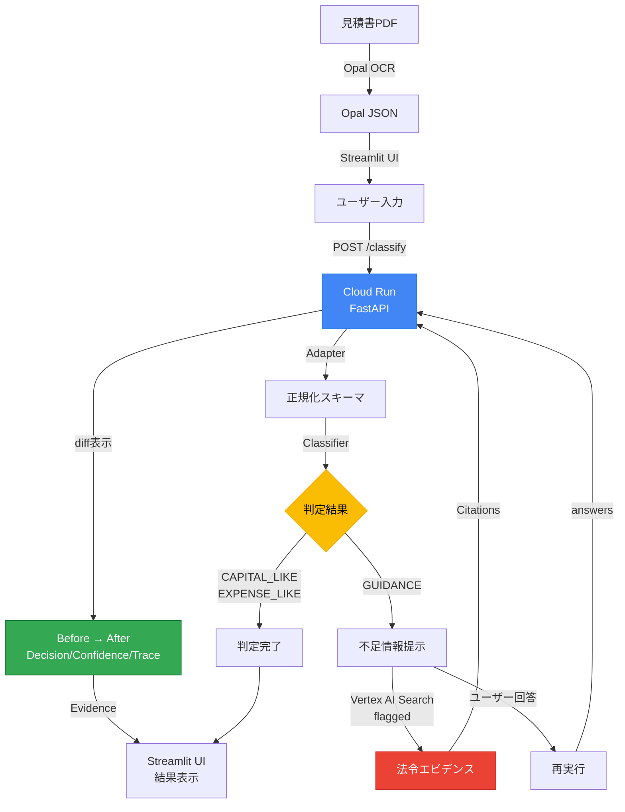

見積書 固定資産判定

― Opal抽出 × Agentic判定（Stop設計）

## ハッカソン提出要件への準拠

本プロジェクトは、**第4回 Agentic AI Hackathon with Google Cloud** の提出要件を満たすため、以下の方針で実装されています。

**詳細は [規約準拠チェックリスト](docs/COMPLIANCE_CHECKLIST.md) を参照してください。**

### 規約準拠の宣言

- **主要技術**: Google Cloud AI（Vertex AI Search / Discovery Engine）を主要技術として使用
- **提出物要件**: コード、説明テキスト＆構成図、デモ動画のすべてを提供
- **デプロイ**: Cloud Run上で動作する公開URLを提供

### 提出物詳細

本プロジェクトは、以下の提出物を提供します：

1. **コード**
   - GitHubリポジトリ: 本リポジトリ（`fixed-asset-agentic-repo`）
   - 主要コンポーネント:
     - FastAPI（`api/main.py`）: Cloud Run上で動作する分類API
     - Streamlit UI（`ui/app_minimal.py`）: デモ用Webインターフェース
     - コアロジック（`core/`）: 分類・正規化・ポリシー適用
     - Vertex AI Search統合（`api/vertex_search.py`）: 法令エビデンス検索（feature-flagged）

2. **説明テキスト＆構成図**
   - 本README.md: プロジェクト概要、システム構成、API仕様、デプロイ手順
   - システム構成図: 上記のMermaid図（PDF → Opal → UI → Cloud Run → Vertex AI Search）
   - DEMO.md: デモ手順（タイムライン形式、Agentic 5-step対応）

3. **デモ動画**
   - デモ手順: `DEMO.md`に記載（3-4分のデモスクリプト）
   - 実際の動画: 別途提出（DEMO.mdの手順に従って録画）

### デモデータについて

**重要**: 本プロジェクトで使用しているすべてのデモデータは**架空データ（ダミーデータ）**です。

- `data/demo/*.json`: デモ用の架空の見積書データ
- `data/golden/*.json`: 評価用の架空のテストケース

実在の企業名、請求書、見積書は一切含まれていません。すべてのデータは、ハッカソン提出用に作成された架空のサンプルデータです。

### 本プロジェクトのAgentic定義

本システムにおける「Agentic AI」は、以下の自律的な判断プロセスを実現します：

1. **止まる（GUIDANCE）**: 判断が割れる可能性がある場合、自動判定を停止
2. **根拠提示**: 判定根拠（Evidence）と不足情報（Missing Fields）を明示
3. **質問**: 不足情報について「なぜ必要か（Why Missing Matters）」を説明し、ユーザーに質問
4. **再実行**: ユーザーの回答を受け取り、再分類を実行
5. **差分保存**: 再実行前後の変化（Decision/Confidence/Trace/Citations）を明確に表示

この設計により、「AIが判断できない場面では自動化を止め、人間の判断を支援する」という協働型のAgentic AIを実現しています。

### システム構成図



概要


本プロジェクトは、見積書の固定資産／費用判定において、

AIが判断を誤る可能性そのものを、設計で吸収する Agentic AI を提案します。


OCRや項目抽出の精度が向上しても、

実務における「判断」は常に文脈依存であり、揺れを伴います。


さらに現場では、

人であっても AI であっても、

その判断を十分に疑う余裕がない状況が頻発します。


本システムは、この前提に立ち、

判断を無理に自動化せず、

判断を行う／止めるを自律的に選択するエージェントとして設計されています。


背景にある構造的な課題（重要）


経理業務では、

人の判断であっても、AIの判断であっても、

常に正しさを検証できるとは限りません。


特に以下のような状況では、


月末・決算期など、時間的余裕がない


人員不足により確認工程が圧縮される


過去と同じ処理を踏襲せざるを得ない


結果として、


「人が判断したから大丈夫」


「AIが出した結果だから正しい」


という 思考停止が起きやすい構造が生まれます。


AIによる自動化は、

この「疑えない状況」を解消するどころか、

誤った判断を高速に通過させてしまうリスクも持っています。


解決したい課題


経理・税務の現場では、以下のような事故が起きがちです。


AIが断定した結果を、そのまま採用してしまう


判断が割れる行（撤去・移設など）が他の行に埋もれる


後から「なぜその処理になったのか」を説明できない


多くの自動化ツールは、

すべてを自動で処理することを前提としており、

止まる設計を持っていません。


本プロジェクトの新規性（Agentic AIとして）


本プロジェクトは、

「AIが迷う場面では自動化を止める」ことを価値とする

Agentic AI の設計パターンを提示します。


ここでいう自律とは、


すべてを自動で処理することではなく、

判断を行う／止めるを選択できること


と定義しています。


システム構成

見積書PDF

&nbsp;  ↓

Opal（OCR・項目抽出）

&nbsp;  ↓  ※揺れるJSON

Adapter（凍結スキーマ v1.0）

&nbsp;  ↓

Classifier（3値判定 + Stop設計）

&nbsp;  ↓

UI（要確認行を可視化・証跡保存）


3ステップの動作概要

Step1｜Opalで抽出（揺れるJSON）


Opalを高性能OCRとして利用し、

項目抽出までを担当させます。

この時点では 判定は行いません。


Step2｜Adapter正規化（凍結スキーマ）


抽出結果を、構造が固定されたスキーマに正規化します。

これにより、後段の判定ロジックを安定させます。


Step3｜Classifier判定（3値・断定しない）


各明細行を以下の3値で判定します。


CAPITAL\_LIKE（資産寄り）


EXPENSE\_LIKE（費用寄り）


GUIDANCE（要確認・判断停止）


判断が割れる語（撤去／移設／既設など）を検知した場合、

自律的に GUIDANCE として停止します。


Stop設計（本プロジェクトの核心）


GUIDANCE は誤判定ではありません。


判断が割れる行を検知した結果


人が確認すべき箇所を明示するための停止


停止理由は flags として証跡に残る


これにより、


誤った自動化を防ぎ


経理担当者は確認すべき行だけに集中でき


後から判断根拠を追跡可能


となります。


利用シーン（1コマ）


月末、経理担当者は

要確認（GUIDANCE）の行だけを優先的に確認すればよくなります。


意図的に実装しなかったもの


本プロジェクトでは、以下を意図的に除外しています。


自動仕訳・自動計上

→ 誤判定時の責任境界が不明確になるため


耐用年数まで含めた自動判定

→ 法改正・企業差異が大きく、

疑う余裕がない状態での断定を避けるため


OCRの自前実装

→ 本質ではなく、Opalに委譲すべきため


なぜ Agentic AI Hackathon なのか


本システムにおける Agent とは、

判断を自律的に「行う／止める」を選択する存在です。


これは、

単なる自動化ではなく、

人とAIの責任分界点を明確にする意思決定支援の実例です。


今後の拡張（構想）


耐用年数マスタとの接続（任意・確認前提）


過去判断履歴との比較（参考情報として）

※前例踏襲による思考停止リスクを伴うため注意


他帳票（請求書・領収書）への横展開


※いずれも Stop設計を維持した上で拡張予定です。


まとめ


本プロジェクトは、

AIの賢さを制限することで、

疑う余裕がない現場でも使える判断支援を実現する

Agentic AI の設計提案です。
Minimal per-company policy hook (v0.1): place a JSON like `policies/company_default.json` to add company-specific keywords, optional GUIDANCE regex, and a caution threshold while keeping the Stop-first design intact. If no policy is provided or it is unreadable, the pipeline behaves exactly as before (schema v1.0 unchanged).

Policyファイル: `policies/company_default.json` を配置。UIはサイドバーで選択、CLIは `POLICY_PATH=policies/company_default.json python scripts/run_pipeline.py --in data/opal_outputs/01_opal.json --out data/results/01_final.json` などで適用できます。

---
Quick links:
- See INDEX.md for autonomous dev rules and gates.
- See docs/00_project.md, docs/01_commands.md, docs/02_arch.md, docs/03_rules.md for context and workflows.
- PDF: `python scripts/run_pdf.py --pdf tests/fixtures/sample_text.pdf --out data/results` (artifacts go to `data/uploads` and `data/results`)
- UI: `streamlit run ui/app.py` then use the JSON tab or the new PDF Upload tab
- API: `uvicorn api.main:app --reload --port 8000` (see API section below)
- Agent (hands-off): on an Issue, add label `agent:run` to let GitHub Actions branch→run checks→push→open PR and comment back. No auto-merge; main requires PR.

## API (FastAPI)

### ローカル起動

```bash
uvicorn api.main:app --reload --port 8000
```

### エンドポイント

#### GET /health
ヘルスチェックエンドポイント（Cloud Run公式）。`/healthz`はCloud Runで予約パスのため使用不可。

```bash
curl http://localhost:8000/health
```

レスポンス: `{"ok": true}`

#### POST /classify
Opal JSONを送信して固定資産判定を実行。WIN+1: オプショナルな`answers`フィールドでagenticループをサポート。

```bash
curl -X POST http://localhost:8000/classify \
  -H "Content-Type: application/json" \
  -d '{
    "opal_json": {
      "invoice_date": "2024-01-01",
      "vendor": "ACME Corp",
      "line_items": [
        {"item_description": "server install", "amount": 5000, "quantity": 1}
      ]
    },
    "policy_path": "policies/company_default.json",
    "answers": {"field1": "value1"}
  }'
```

`policy_path` が指定されない場合、デフォルトで `policies/company_default.json` が使用されます。
`answers` はオプショナルで、GUIDANCE判定時に不足情報を補完して再分類を試みます。

#### POST /classify_pdf (Optional, Feature-Flagged)

PDFファイルを直接アップロードして固定資産判定を行います。

**Feature Flag:** `PDF_CLASSIFY_ENABLED=1` (デフォルト: OFF)

- **OFF時**: 400エラーで「PDF classification is disabled」を返す（クラッシュしない）
- **ON時**: PDFをアップロード→抽出→正規化→分類→レスポンス（`/classify`と同じ形式）

**リクエスト形式:**
- `multipart/form-data`
- `file`: PDFファイル（`application/pdf`）

**レスポンス形式:**
- `/classify`と同じ`ClassifyResponse`形式
- `trace`に`pdf_upload`, `extract`, `extraction_to_opal`, `parse`, `rules`, `format`が含まれる

**使用例（PowerShell）:**
```powershell
# Feature flagを有効化（ローカルテスト時）
$env:PDF_CLASSIFY_ENABLED="1"

# PDFをアップロード
$pdfPath = ".\data\demo\sample.pdf"
$response = Invoke-RestMethod -Uri "$ServiceUrl/classify_pdf" -Method Post -InFile $pdfPath -ContentType "multipart/form-data"
```

**UI動作（サーバ真実ベース）:**
- **PDF Upload UI:** 常に表示される（ローカル環境変数は参照しない）。ユーザーは常にPDFアップロード欄を見ることができる。
- **サーバ状態検出:** PDFをアップロードして「Classify PDF」をクリックすると、UIは`/classify_pdf`を呼び出し、API応答からサーバ側のfeature flag状態を検出する：
  - **サーバがOFF（400/503で"disabled"）:** UIは明確なエラーを表示：「Server-side PDF_CLASSIFY_ENABLED=1 is required (feature is OFF on server)」とサーバ応答の詳細。これにより、Cloud Run側だけがONなのにUIがOFF表示になる事故を防ぐ。
  - **サーバがON:** 通常の分類が進行し、Opal JSONフローと同じevidence-first表示、GUIDANCE loop、DIFF cardが表示される。

**注意:**
- デフォルトはOFF。テストやgolden set評価では不要。
- PDF処理は`core/pdf_extract.py`の関数を使用（core/*は変更しない）。
- 抽出が不十分な場合は`GUIDANCE`として返す（Stop-first設計）。
- **UIは常にPDFアップロード欄を表示し、サーバ状態は実際のAPI応答（サーバ真実）で判断される。ローカル環境変数は参照しない。**

レスポンス形式:
```json
{
  "decision": "CAPITAL_LIKE|EXPENSE_LIKE|GUIDANCE",
  "reasons": ["判定理由のリスト"],
  "evidence": [{"line_no": 1, "description": "...", "source_text": "...", "confidence": 0.8, ...}],
  "questions": ["GUIDANCE項目に対する確認質問"],
  "metadata": {"version": "v1.0", "document_info": {...}, "totals": {...}, ...},
  "is_valid_document": true,
  "confidence": 0.8,
  "error_code": null,
  "trace": ["extract", "parse", "rules", "format"],
  "missing_fields": ["field1", "field2"],
  "why_missing_matters": ["Missing information prevents classification"]
}
```

WIN+1追加フィールド:
- `is_valid_document`: ドキュメントが有効かどうか
- `confidence`: 判定の信頼度（0.0-1.0）
- `error_code`: エラーコード（エラー時のみ）
- `trace`: 実行ステップのトレース
- `missing_fields`: GUIDANCE時に不足しているフィールドのリスト
- `why_missing_matters`: 不足情報が判定に与える影響の説明
- `evidence[].confidence`: 各エビデンス項目の信頼度（デフォルト0.8）

### Docker ビルド・実行

```bash
# ビルド
docker build -t fixed-asset-api .

# ローカル実行（ポート8080で起動）
docker run -p 8080:8080 -e PORT=8080 fixed-asset-api
```

### Cloud Run デプロイ

**前提条件:** GCPプロジェクトにBillingアカウントをリンクしてください。

#### デプロイ手順（最短）

```bash
# 1. プロジェクト設定
gcloud config set project YOUR_PROJECT_ID

# 2. 必要APIを有効化
gcloud services enable run.googleapis.com artifactregistry.googleapis.com aiplatform.googleapis.com

# 3. Cloud Runにデプロイ
gcloud run deploy fixed-asset-agentic-api \
  --source . \
  --region asia-northeast1 \
  --allow-unauthenticated

# 4. デプロイ後のスモーク確認（/health → /classify → /classify_pdf OFF）
# PowerShell（1コマンドずつ。&&は使わない）
curl.exe -s https://SERVICE_URL/health
# → {"ok":true} であること

# /classify は JSON で POST（略）。/classify_pdf は既定 OFF で 400 + detail.error=PDF_CLASSIFY_DISABLED を期待。
# 確認項目: detail.how_to_enable と detail.fallback が含まれること（UI表示用）。
# 一括実行する場合:
.\scripts\smoke_cloudrun.ps1
# （$env:CLOUD_RUN_URL 未設定時は既定 Cloud Run URL を使用。上記 3 段階をすべて検証）
```

#### 方法2: 事前ビルドしたイメージからデプロイ

#### 方法2: 事前ビルドしたイメージからデプロイ

```bash
# GCR/Artifact Registryにプッシュ
docker tag fixed-asset-api gcr.io/YOUR_PROJECT_ID/fixed-asset-api
docker push gcr.io/YOUR_PROJECT_ID/fixed-asset-api

# Cloud Runにデプロイ
gcloud run deploy fixed-asset-api \
  --image gcr.io/YOUR_PROJECT_ID/fixed-asset-api \
  --platform managed \
  --region asia-northeast1 \
  --allow-unauthenticated
```

Cloud Runは自動的に `PORT` 環境変数を設定します。コンテナ内のアプリケーションは `0.0.0.0:$PORT` でリッスンします。

## Evaluation

### Golden Set Evaluation

評価用のゴールデンセット（10ケース）が `data/golden/` に含まれています。
各ケースは `caseXX_request.json` と `caseXX_expected.json` のペアで構成されています。

評価スクリプトを実行:

```bash
python scripts/eval_golden.py
```

出力例:
```
============================================================
Golden Set Evaluation
============================================================

PASS: Case 01: PASS
PASS: Case 02: PASS
...
PASS: Case 10: PASS

============================================================
Summary
============================================================
Total cases: 10
Passed: 10
Failed: 0
Accuracy: 100.0%

All tests passed!
```

### Current Score

- **Golden Set Accuracy: 100.0%** (10/10 cases passed)
- Last evaluated: 2026-01-20

## OSS/Licenses

本プロジェクトは以下のオープンソースライブラリを使用しています。各ライブラリのライセンスを遵守しています。

### 主要依存関係

- **pytest** (MIT License): テストフレームワーク
- **streamlit** (Apache License 2.0): Web UIフレームワーク
- **PyMuPDF (fitz)** (AGPL-3.0 License): PDF処理ライブラリ
- **fastapi** (MIT License): Web APIフレームワーク
- **uvicorn** (BSD License): ASGIサーバー
- **gunicorn** (MIT License): WSGI HTTPサーバー
- **requests** (Apache License 2.0): HTTPライブラリ

### オプション依存関係

- **google-cloud-discoveryengine** (Apache License 2.0): Vertex AI Search統合（feature-flagged、デフォルトOFF）

各ライブラリのライセンス全文は、各パッケージの公式リポジトリまたはPyPIで確認できます。

**注意**: PyMuPDF (fitz) は AGPL-3.0 ライセンスです。商用利用の場合は適切なライセンス確認が必要です。
