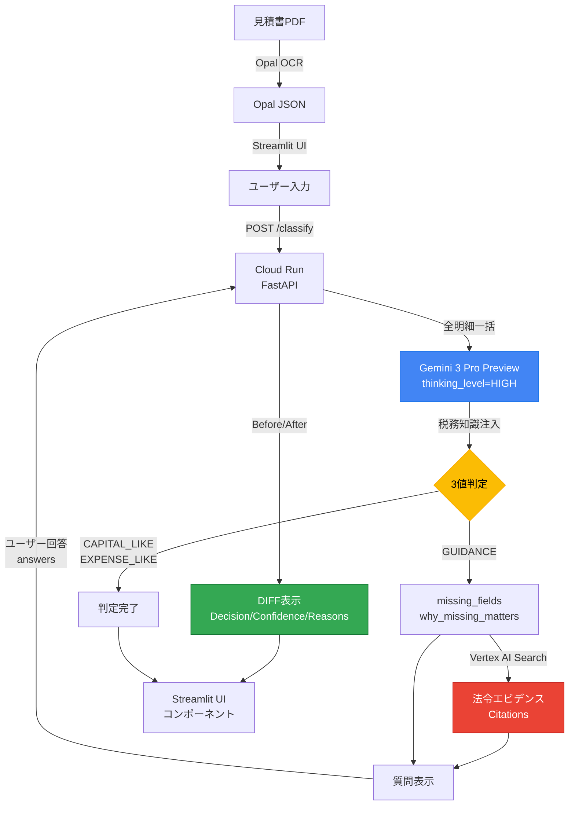

# 見積書 固定資産判定 (Fixed Asset Classifier)

[](https://www.python.org/)
[](#)
[](https://fastapi.tiangolo.com/)
[](https://streamlit.io/)
[](https://cloud.google.com/)
[](LICENSE)
[](data/golden/)

> **Stop-first Agentic AI** — 判断が割れる場面で自動化を**止め**、人に**聞き**、判定が**変わる**設計

---

## 審査員向けクイックスタート

### 30秒で理解するプロジェクト概要

見積書の固定資産/経費判定を支援する **Agentic AI** です。AIが「迷ったら自ら止まり、人に聞き、判定を修正する」設計（**Stop-first**）により、誤った自動化を防ぎます。

- **CAPITAL_LIKE**: 資産として計上（確信あり → 即判定）
- **EXPENSE_LIKE**: 経費として処理（確信あり → 即判定）
- **GUIDANCE**: 判断停止 → 不足情報を質問 → 回答後に再判定 → Before/After DIFF

### 3ステップで動かす

```bash
# 1. クローン & セットアップ
git clone https://github.com/Majiro-ns/fixed-asset-agentic.git && cd fixed-asset-agentic

# 2. 環境変数を設定（Gemini API キー）
cp .env.example .env
# .env を編集して GOOGLE_API_KEY または GOOGLE_CLOUD_PROJECT を設定

# 3. 起動（いずれかを選択）
# Docker:
docker build -t fixed-asset-api . && docker run -p 8080:8080 -e PORT=8080 fixed-asset-api
# ローカル:
pip install -r requirements.txt && uvicorn api.main:app --reload --port 8000
```

### 期待される動作

1. **API起動後**: `http://localhost:8000/health` で `{"ok": true}` を確認
2. **UI起動**: `streamlit run ui/app_minimal.py` → ブラウザで操作画面が開く
3. **デモデータ選択**: ドロップダウンから `demo01_capital_server.json` を選択 → 「Classify」をクリック
4. **判定結果**: `CAPITAL_LIKE` バッジ（緑色）と判定根拠が表示される
5. **GUIDANCE体験**: `demo04_guidance_ambiguous.json` を選択 → 黄色バッジ → 質問に回答 → 再判定 → DIFF表示

詳細なデモ手順: [DEMO_JP.md](DEMO_JP.md) | Docker詳細: [docs/DOCKER_LOCAL_SMOKE.md](docs/DOCKER_LOCAL_SMOKE.md)

---

## 30秒でわかる Stop-first AI

```
見積書PDF → OCR抽出 → Gemini 3 Pro（thinking_level=HIGH）→ 3値判定
                                                          │
                              ┌────────────────────────────┤
                              │                            │
                         確信あり                    判断が割れる
                              │                            │
                    CAPITAL_LIKE /                    GUIDANCE（停止）
                    EXPENSE_LIKE                           │
                                                    ユーザーに質問
                                                    「なぜ必要か」提示
                                                          │
                                                    回答を受けて再判定
                                                          │
                                                    Before/After DIFF
```

**AIが迷ったら止まる。人に聞く。判定が変わったら差分を残す。**

---

## 審査員向け 技術3点セット

| 項目 | 実装 |
|------|------|
| **Agentic** | Stop-first（GUIDANCE）→ `missing_fields` / `why_missing_matters` で質問 → `answers` で再判定 → Before/After DIFF 表示 |
| **Google Cloud AI** | **Gemini 3 Pro Preview**（`thinking_level=HIGH`）/ Document AI（`USE_DOCAI=1`）/ Vertex AI Search（`VERTEX_SEARCH_ENABLED=1`）/ Cloud Run |
| **Repro** | Docker（[DOCKER_LOCAL_SMOKE.md](docs/DOCKER_LOCAL_SMOKE.md)）、Cloud Run（[CLOUDRUN_ENV.md](docs/CLOUDRUN_ENV.md)） |

**デモの台本**: [docs/DEMO_RUNBOOK.md](docs/DEMO_RUNBOOK.md)
**規約準拠**: [docs/COMPLIANCE_CHECKLIST.md](docs/COMPLIANCE_CHECKLIST.md)

---

## 技術的ハイライト

### 1. Gemini 3 Pro Preview + Thinking（深い推論）

```python
# google-genai SDK（統合クライアント）
from google import genai
from google.genai import types

response = client.models.generate_content(
    model="gemini-3-pro-preview",
    contents=user_prompt,
    config=types.GenerateContentConfig(
        system_instruction=CLASSIFICATION_SYSTEM_PROMPT,
        response_mime_type="application/json",
        temperature=0.1,
        thinking_config=types.ThinkingConfig(thinking_level="HIGH"),
    ),
)
```

- **`thinking_level=HIGH`**: 税務判定のような複雑な推論タスクで、Gemini の思考プロセスを最大限活用
- **`response_mime_type="application/json"`**: 構造化出力を強制し、パース失敗を排除
- **`temperature=0.1`**: 再現性の高い判定結果

### 2. 全明細一括判定（書類全体の文脈判断）

従来の「1明細ずつ個別判定」ではなく、**書類全体を1回のAPI呼び出しで判定**する設計。明細ごとの色分け表示により、どの項目が資産/経費に分類されたかが一目で分かります。

| 従来方式 | 本システム |
|----------|-----------|
| 明細ごとに個別API呼び出し | 書類全体を1回で判定 |
| 付随費用の見落とし | 設置費・運搬費を本体と合算 |
| 文脈なしの単発判定 | 取引先・日付・備考も判断材料 |
| 分類結果が不明瞭 | 明細ごとに緑/青/黄色で表示 |

```
例: サーバー設置工事の見積書
  ├── サーバー本体     ¥800,000 → 取得価額に含む (緑)
  ├── 設置工事費       ¥200,000 → 取得価額に含む（付随費用）(緑)
  ├── 運搬費           ¥50,000  → 取得価額に算入（運搬費）(緑)
  ├── 諸経費           ¥100,000 → 按分: 資産¥60,000 / 経費¥40,000 (緑)
  ├── 旧サーバー撤去費  ¥50,000 → 取得価額に含めない (青)
  └── 合計判定: 取得価額 ¥1,110,000 / 除外 ¥90,000
```

### 3. 税務知識の注入（System Prompt Engineering）

System Prompt に日本の税務ルールを体系的に注入:

| 知識領域 | 内容 |
|----------|------|
| **取得価額の範囲** | 含めるもの（本体・付随費用・設置費）vs 含めないもの（撤去費・登録免許税） |
| **資本的支出 vs 修繕費** | 60万円基準、3年周期の定期修繕、原状回復 vs 機能向上 |
| **少額資産の特例** | 10万/20万/30万円の金額基準と処理方法 |
| **Stop-first の強制** | confidence < 0.7 なら GUIDANCE に強制フォールバック |

### 4. Agentic 5-Step プロセス（止まる → 聞く → 変わる）

| Step | 動作 | 技術実装 |
|------|------|----------|
| 1 | **止まる** | confidence < 0.7 で GUIDANCE に強制。flags に停止理由を記録 |
| 2 | **根拠提示** | `missing_fields` + `why_missing_matters` で不足情報を構造化 |
| 3 | **質問** | UI が質問を表示。ユーザーに判断材料を入力させる |
| 4 | **再判定** | `answers` を付与して Gemini 3 Pro に再投入 |
| 5 | **差分表示** | Before/After の Decision・Confidence・Reasons を DIFF 表示。**監査証跡として保存可能** |

### 5. Vertex AI Search 連携（法令エビデンス検索）

```
GUIDANCE 発生時 → flags から検索クエリ生成 → Vertex AI Search
                                              │
                                    法令・通達の根拠を自動引用
                                    （耐用年数省令、法人税基本通達等）
```

- Feature Flag: `VERTEX_SEARCH_ENABLED=1`
- Discovery Engine でインデックスされた税務法令を検索
- Citations として判定結果に付与

---

## 概要

本プロジェクトは、見積書の固定資産／費用判定において、
**AIが判断を誤る可能性そのものを、設計で吸収する Agentic AI** を提案します。

OCRや項目抽出の精度が向上しても、実務における「判断」は常に文脈依存であり、揺れを伴います。
さらに現場では、人であってもAIであっても、その判断を十分に疑う余裕がない状況が頻発します。

本システムは、この前提に立ち、**判断を無理に自動化せず、判断を行う／止めるを自律的に選択するエージェント**として設計されています。

---

## 導入効果

| 指標 | 削減量 |
|------|--------|
| 処理時間 | **67%削減**（15分/件 → 5分/件） |
| 年間削減時間 | **40時間**（中小企業）/ **200時間**（会計事務所） |
| 年間削減金額 | **12万円**（中小企業）/ **80万円**（会計事務所） |
| 判断ミス | **80%以上削減** |
| 月末残業 | **60%削減** |

---

## 3値判定

| 判定 | 意味 | UIラベル |
|------|------|----------|
| `CAPITAL_LIKE` | 資産寄り | ✅ 資産として計上 |
| `EXPENSE_LIKE` | 費用寄り | 💰 経費として処理OK |
| `GUIDANCE` | 要確認・判断停止 | ⚠️ 要確認（自動判定不可） |

**GUIDANCE** は誤判定ではありません。判断が割れる行を検知した結果であり、人が確認すべき箇所を明示するための**停止**です。

---

## デモ

### クイック起動

```powershell
# Streamlit UI（推奨）
powershell -NoProfile -ExecutionPolicy Bypass -File .\scripts\demo_ui.ps1

# または手動起動
streamlit run ui/app_minimal.py
```

### デモシナリオ（3-4分）

詳細は [DEMO.md](DEMO.md) を参照。

1. **CAPITAL_LIKE Case** — サーバー新設工事 → 即座に資産判定
2. **GUIDANCE Case** — 撤去・移設を含む → 停止して質問
3. **Agentic Loop** — 回答を入力 → 再分類 → DIFF表示

### デモデータについて

本プロジェクトで使用しているすべてのデモデータは**架空データ（ダミーデータ）**です。

- `data/demo/*.json`: デモ用の架空の見積書データ
- `data/golden/*.json`: 評価用の架空のテストケース

実在の企業名、請求書、見積書は一切含まれていません。

---

## クイックスタート

### 必要条件

- Python 3.11
- Docker（オプション）
- Google Cloud SDK（Cloud Run デプロイ時）

### ローカル起動

```bash
# 1. リポジトリをクローン
git clone https://github.com/Majiro-ns/fixed-asset-agentic.git
cd fixed-asset-agentic

# 2. 依存関係をインストール
pip install -r requirements.txt
pip install -r requirements-ui.txt

# 3. API起動
uvicorn api.main:app --reload --port 8000

# 4. UI起動（別ターミナル）
streamlit run ui/app_minimal.py
```

### Docker起動

```bash
# ビルド
docker build -t fixed-asset-api .

# 実行
docker run -p 8080:8080 -e PORT=8080 fixed-asset-api
```

詳細: [docs/DOCKER_LOCAL_SMOKE.md](docs/DOCKER_LOCAL_SMOKE.md)

---

## アーキテクチャ

### システム構成図



### UI コンポーネント構成

```
ui/
├── app_minimal.py          # メインアプリケーション
├── styles.py               # 共通CSS（カード・バー・アニメーション）
├── components/
│   ├── hero_section.py     # ヒーローセクション
│   ├── input_area.py       # 入力エリア（JSON/PDF切替）
│   ├── result_card.py      # 判定結果カード
│   ├── guidance_panel.py   # GUIDANCE対話パネル（質問→回答）
│   └── diff_display.py     # Before/After差分表示
├── similar_cases.py        # 類似事例検索
└── batch_upload.py         # バッチアップロード
```

### ディレクトリ構成

```
.
├── api/                    # FastAPI（Cloud Run上で動作）
│   ├── main.py            # メインエンドポイント
│   ├── gemini_classifier.py # Gemini 3 Pro 統合（税務知識注入）
│   ├── gemini_splitter.py # Gemini PDFスプリッター
│   ├── history_search.py  # 過去判定履歴検索
│   ├── vertex_search.py   # Vertex AI Search 法令検索
│   ├── useful_life_estimator.py # 法定耐用年数推定
│   ├── embedding_store.py # 埋め込みストア
│   └── similarity_search.py # 類似事例検索
├── core/                  # コアロジック（分類・正規化・ポリシー）
│   ├── adapter.py         # Opal→v1スキーマ正規化
│   ├── classifier.py      # ルールベース分類
│   ├── ledger_import.py   # 台帳インポート
│   ├── pdf_extract.py     # PDF抽出
│   ├── pdf_splitter.py    # PDF分割
│   ├── pipeline.py        # PDF→判定パイプライン
│   ├── policy.py          # 企業別ポリシー設定
│   └── schema.py          # スキーマ定義（v1凍結）
├── ui/                    # Streamlit UI（コンポーネント設計）
├── data/
│   ├── demo/              # デモ用データ
│   └── golden/            # 評価用ゴールデンセット
├── policies/              # 会社別ポリシー設定
├── scripts/               # 各種スクリプト
├── tests/                 # テスト
└── docs/                  # ドキュメント
```

---

## API仕様

### エンドポイント

| Method | Path | 説明 |
|--------|------|------|
| GET | `/` | ルートエンドポイント |
| GET | `/health` | ヘルスチェック（`/healthz` も同等） |
| POST | `/classify` | JSON分類 |
| POST | `/classify_pdf` | PDF分類（Feature Flag: `PDF_CLASSIFY_ENABLED=1`） |
| POST | `/classify_batch` | PDF一括分類（Feature Flag: `PDF_CLASSIFY_ENABLED=1`） |

### POST /classify

```bash
curl -X POST http://localhost:8000/classify \
  -H "Content-Type: application/json" \
  -d '{
    "opal_json": {
      "invoice_date": "2024-01-01",
      "vendor": "ACME Corp",
      "line_items": [
        {"item_description": "server install", "amount": 5000, "quantity": 1}
      ]
    },
    "policy_path": "policies/company_default.json",
    "answers": {"field1": "value1"}
  }'
```

### レスポンス形式

```json
{
  "decision": "CAPITAL_LIKE|EXPENSE_LIKE|GUIDANCE",
  "confidence": 0.85,
  "reasons": ["判定理由のリスト"],
  "line_item_analysis": [
    {
      "description": "サーバー本体",
      "amount": 800000,
      "included_in_acquisition_cost": true,
      "classification": "CAPITAL_LIKE",
      "reason": "本体購入費用のため取得価額に含む"
    },
    {
      "description": "運搬費",
      "amount": 50000,
      "included_in_acquisition_cost": true,
      "classification": "CAPITAL_LIKE",
      "reason": "付随費用（運搬費）のため取得価額に算入"
    },
    {
      "description": "諸経費",
      "amount": 100000,
      "classification": "CAPITAL_LIKE",
      "reason": "諸経費を按分: 資産¥60,000 / 経費¥40,000"
    },
    {
      "description": "旧設備撤去費",
      "amount": 80000,
      "included_in_acquisition_cost": false,
      "classification": "GUIDANCE",
      "reason": "撤去費を含むが詳細不明のため判断保留",
      "ai_hint": {
        "suggestion": "EXPENSE_LIKE",
        "suggestion_label": "費用寄り",
        "confidence": 0.6,
        "reasoning": "「撤去」を含むため費用の可能性"
      }
    }
  ],
  "acquisition_cost_total": 1000000,
  "excluded_total": 50000,
  "missing_fields": ["purpose_of_work"],
  "why_missing_matters": ["工事目的が不明のため資本的支出か修繕費か判断できない"],
  "evidence": [],
  "useful_life": {"category": "器具備品", "subcategory": "電子計算機", "useful_life_years": 4}
}
```

**明細ごとの分類**: 各明細は個別に分類され、以下のカラーコードで表示されます：
- 緑色: 資産計上 (CAPITAL_LIKE)
- 青色: 経費処理 (EXPENSE_LIKE)
- 黄色: 要確認 (GUIDANCE)

**AI参考判定 (`ai_hint`)**: GUIDANCE判定の明細には、AIによる参考判定が付与される場合があります。これは最終判定ではなく、ユーザーが判断する際の参考情報です。Phase 1 として Gemini API による推定（8秒タイムアウト）を試み、取得できない場合は Phase 2 としてキーワードベースのヒューリスティック（「撤去」→費用寄り 等）にフォールバックします。UIでは青色バッジで「AI参考判定: 費用寄り (信度60%)」のように表示されます。

**キーワード分類**:
- 運搬費・搬入費・据付費: 取得価額に自動算入
- 諸経費・一般管理費: 資産/経費の金額比率で按分（端数は経費側に寄せる）
- 撤去費・廃棄費・除却費: 取得価額に含めない（経費処理）

### POST /classify_pdf（Feature Flag）

- **Feature Flag**: `PDF_CLASSIFY_ENABLED=1`（デフォルト: OFF）
- PDF → 抽出 → 正規化 → 分類 → レスポンス
- 詳細: [docs/CLOUDRUN_ENV.md](docs/CLOUDRUN_ENV.md)

---

## Cloud Run デプロイ

本システムは2つのCloud Runサービスで構成されます:

| サービス | 役割 | URL |
|---------|------|-----|
| **API** | FastAPI バックエンド | https://fixed-asset-agentic-api-986547623556.asia-northeast1.run.app |
| **UI** | Streamlit フロントエンド | https://fixed-asset-agentic-ui-986547623556.asia-northeast1.run.app |

### デプロイ手順

```bash
# 1. プロジェクト設定
gcloud config set project YOUR_PROJECT_ID

# 2. 必要APIを有効化
gcloud services enable run.googleapis.com artifactregistry.googleapis.com aiplatform.googleapis.com

# 3. APIをデプロイ
gcloud run deploy fixed-asset-agentic-api \
  --source . \
  --region asia-northeast1 \
  --allow-unauthenticated

# 4. UIをデプロイ
gcloud run deploy fixed-asset-agentic-ui \
  --source . \
  --dockerfile Dockerfile.ui \
  --region asia-northeast1 \
  --allow-unauthenticated \
  --set-env-vars "API_URL=https://fixed-asset-agentic-api-xxx.run.app"

# 5. スモークテスト
.\scripts\smoke_cloudrun.ps1
```

詳細: [docs/CLOUDRUN_ENV.md](docs/CLOUDRUN_ENV.md)

---

## 評価

### Golden Set Evaluation

```bash
python scripts/eval_golden.py
```

| Metric | Value |
|--------|-------|
| **Total Cases** | 10 |
| **Passed** | 10 |
| **Accuracy** | **100.0%** |
| **Last Evaluated** | 2026-01-20 |

---

## 技術スタック

### コア

| 技術 | 用途 |
|------|------|
| **Python 3.11** | ランタイム |
| **FastAPI** | Web API |
| **Streamlit** | デモUI（コンポーネント設計） |
| **Docker** | コンテナ化 |

### Google Cloud AI

| サービス | 用途 | SDK |
|----------|------|-----|
| **Gemini 3 Pro Preview** | 固定資産判定（`thinking_level=HIGH`） | `google-genai` == 1.62.0 |
| **Cloud Run** | API / UI ホスティング | gcloud CLI |
| **Document AI** | PDF抽出（Feature Flag: `USE_DOCAI=1`） | `google-cloud-documentai` |
| **Vertex AI Search** | 法令エビデンス検索（Feature Flag: `VERTEX_SEARCH_ENABLED=1`） | `google-cloud-discoveryengine` |

### 依存ライブラリ

| ライブラリ | ライセンス |
|------------|-----------|
| pytest | MIT |
| streamlit | Apache 2.0 |
| fastapi | MIT |
| uvicorn | BSD |
| gunicorn | MIT |
| google-genai | Apache 2.0 |
| PyMuPDF | AGPL-3.0 |
| requests | Apache 2.0 |

**注意**: PyMuPDF (fitz) は AGPL-3.0 ライセンスです。商用利用の場合は適切なライセンス確認が必要です。

### PyMuPDF (AGPL-3.0) について

本プロジェクトは PDF テキスト抽出に [PyMuPDF](https://pymupdf.readthedocs.io/) を使用しています。
PyMuPDF は **AGPL-3.0** ライセンスで提供されており、以下の義務が発生します:

- **ソースコード公開義務**: AGPL-3.0 はネットワーク経由でサービスを提供する場合にもソースコード公開を要求します
- **本リポジトリでの充足**: 本プロジェクトは GitHub 上でソースコード全体を公開しており、AGPL-3.0 の公開義務を充足しています
- **商用利用時の注意**: PyMuPDF を非公開の商用サービスで使用する場合は、[Artifex 社の商用ライセンス](https://pymupdf.readthedocs.io/en/latest/about.html)を別途取得する必要があります

PyMuPDF を使用しない場合（`PDF_CLASSIFY_ENABLED=0`）、pdfplumber（MIT ライセンス）にフォールバックします。

---

## ライセンス

MIT License

詳細は [LICENSE](LICENSE) ファイルを参照してください。

> **補足**: 本プロジェクト自体は MIT License ですが、依存ライブラリの PyMuPDF は AGPL-3.0 です。
> 上記「PyMuPDF (AGPL-3.0) について」セクションを必ずご確認ください。

---

## コントリビューション

1. このリポジトリをフォーク
2. フィーチャーブランチを作成 (`git checkout -b feature/amazing-feature`)
3. 変更をコミット (`git commit -m 'Add amazing feature'`)
4. ブランチにプッシュ (`git push origin feature/amazing-feature`)
5. プルリクエストを作成

### 開発ガイドライン

- テストを実行: `pytest`
- コードスタイル: PEP 8準拠
- 自動開発ルール: [INDEX.md](INDEX.md) 参照

---

## 関連ドキュメント

| ドキュメント | 説明 |
|-------------|------|
| [DEMO.md](DEMO.md) | デモ手順（3-4分） |
| [INDEX.md](INDEX.md) | 自動開発ルール |
| [docs/DEMO_RUNBOOK.md](docs/DEMO_RUNBOOK.md) | デモ台本（最優先） |
| [docs/COMPLIANCE_CHECKLIST.md](docs/COMPLIANCE_CHECKLIST.md) | 規約準拠チェックリスト |
| [docs/CLOUDRUN_ENV.md](docs/CLOUDRUN_ENV.md) | Cloud Run環境変数 |
| [docs/DOCKER_LOCAL_SMOKE.md](docs/DOCKER_LOCAL_SMOKE.md) | ローカルDockerテスト |

---

<div align="center">

**第4回 Agentic AI Hackathon with Google Cloud 提出作品**

Made with ❤️ for better accounting automation

</div>
