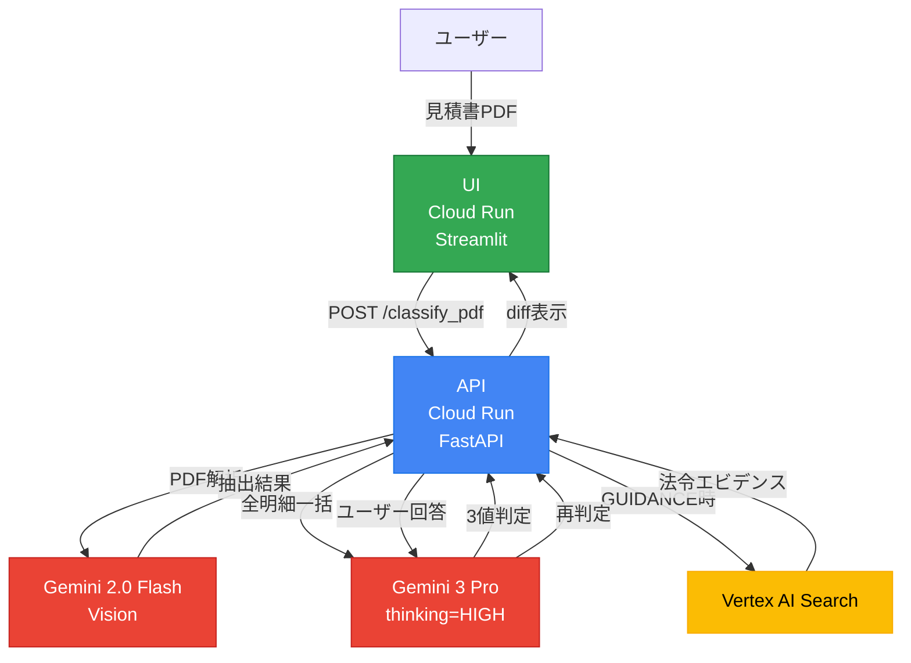

:::message
**30秒でわかるStop-first AI**
[デモ動画を見る](#デモ動画) | [GitHubリポジトリ](https://github.com/Majiro-ns/fixed-asset-agentic)
:::

# 「止まれないAI」が本当の脅威だ

**AIの自動化で、年間数百万円の税務リスクが発生している企業があります。**

問題は「AIが間違える」ことではありません。**「AIが止まらない」**ことです。

私たちは、**意図的に止まるAI**を作りました。

---

## デモ動画

@[youtube](0Qzfw8eCQ9g)

---

## 背景：月末の経理部門で起きていること

月末の経理部門。机には未処理の見積書が山積みになっています。

**「この工事、資本的支出？ それとも修繕費？」**

経理担当者は考えます。でも、月末の締め作業に追われて**判断を疑う余裕がありません**。結局、「去年と同じ処理でいいか」と決めてしまいます。

そして数年後、税務調査で「なぜこの処理にしたのですか？」と問われます。

> 「空調設備 更新工事 一式 1,200,000円」
>
> 更新って、新規購入？ それとも既存設備の修繕？
> 「一式」の中身が分からないと判断できない...

AIによる自動化が進む今、こんな声を聞くようになりました。

> 「AIが判定してくれるなら、そのまま採用すればいいじゃないか」

その考えが、**誤った判断を高速に通過させてしまいます**。

---

## Stop-first設計とは

私たちが提案するのは「**Stop-first Agentic AI**」という設計思想です。

| 従来のAI自動化 | Stop-first AI |
|--------------|--------------|
| 「速さ」が正義 | 「正確さ」が正義 |
| エラー時にアラート | **曖昧な時点で停止** |
| 人間は事後確認 | 人間は事前承認 |
| 自動化率が目標 | **判断品質が目標** |

核心はシンプルです：

> **AIが「わからない」と言える設計にします。**

```
  自律 ≠ すべてを自動で処理すること
  自律 = 判断を「行う」か「止める」かを選択できること
```

---

## 3値判定モデル

Asset Agenticは見積書の明細を**3つの値**で判定します。

| 判定 | 意味 | AIの行動 |
|------|------|----------|
| **CAPITAL_LIKE** | 資産計上の可能性が高い | 自動判定 |
| **EXPENSE_LIKE** | 経費処理の可能性が高い | 自動判定 |
| **GUIDANCE** | 判断が割れる | **判定を停止し、人間に委ねる** |

GUIDANCEは「誤判定」ではありません。**判断すべき箇所を人間に示すための意図的な停止**です。


### なぜ「止まる」のか

Gemini 3 Proに税法知識を注入し、**書類全体の文脈**から判定しています。以下の条件で自律的に停止します：

- **曖昧なキーワード**: 「一式」「移設」「更新」を検出
- **競合キーワード**: 資産キーワードと経費キーワードが混在する場合
- **金額閾値**: 10万/20万/30万/60万の境界で安全側に倒す（キーワード判定がない場合のみ）
- **書類全体の矛盾**: 明細の合計と個別判定が食い違う場合
- **信頼度不足**: Geminiの判定確信度が70%未満

**明細ごとの自動処理**:
- **運搬費・搬入費・据付費**: 取得価額に自動算入（緑色表示）
- **撤去費・廃棄費・除却費**: 経費として処理（青色表示）
- **諸経費・一般管理費**: 資産/経費の金額比率で按分（緑または青色表示）
- **混在・不明**: 要確認（黄色表示）

### AI参考判定（GUIDANCE項目への補助情報）

GUIDANCEで停止した明細には、AIによる参考判定（`ai_hint`）が付与される場合があります。判定はしません（GUIDANCE維持）が、AIの見解は参考として提示する設計です。Gemini APIによる推定を第一候補とし、タイムアウト時はキーワードヒューリスティックにフォールバックします。UIでは「AI参考判定: 費用寄り (信度60%)」のように青色バッジで表示され、ユーザーが判断する際の補助情報として機能します。

---

## 止まる→聞く→変わる：5ステップのAgenticループ

ここがAsset Agenticの核心です。

### ステップ1：止まる

AIが「判断が割れる」と判定し、自動処理を停止します。


### ステップ2：理由を示す

なぜ止まったのかを具体的に提示します。

- 「**購入目的が不明です** → 目的によって資産計上か経費処理かが変わります」
- 「**撤去費が含まれている可能性** → 撤去費は取得価額に含めません」

### ステップ3：聞く（2段階の対話）

ユーザーに2段階で質問します。

**1回目:** 「この支出の目的を教えてください」

→ [修繕・維持] or [新規購入・増強]

**2回目:** 選択に応じた追加質問

→ 修繕の場合：「修繕の頻度を教えてください」 [定期的] or [今回が初めて]
→ 新規の場合：「既存設備の入替ですか？」 [はい] or [いいえ]


### ステップ4：再実行

ユーザーの回答を踏まえてAIが再判定します。

### ステップ5：差分を見せる

Before → After で何が変わったかを明示します。


> **この差分は監査時の説明資料として利用できます。**

判定が変わった理由が、証跡として自動記録されます。税務調査で「なぜこの処理にしたのですか？」と問われた時、この記録が回答になります。

---

## 似た事例の提示（セレンディピティ）

GUIDANCEで止まった時、AIが**似た実務事例**を1つ提示します。

> **似た事例：** 空調設備の更新工事で撤去費を含むケース
> **結果：** 撤去費を除外し、資本的支出80万円＋修繕費40万円に分離
> **教訓：** 「一式」の中に撤去費が含まれる場合、分離計上が有利なことがある

ユーザーが自分では気づかなかった視点を、AIが提供します。**判定だけでなく、判断の質を上げる支援**です。

---

## システム構成



### Google Cloud AIの活用

| サービス | 役割 | 用途 |
|---------|------|------|
| **Gemini 3 Pro Preview** | 分類判定・耐用年数推定 | 税法知識を注入し、全明細を一括判定。`thinking_level=HIGH` |
| **Gemini 2.0 Flash** | PDF読み取り・文書分割 | Vision APIで手書き対応の高精度抽出 |
| **Document AI** | PDF構造解析（拡張） | 高精度OCR・テーブル抽出（`USE_DOCAI=1`で有効化） |
| **Vertex AI Search** | 法令エビデンス検索 | GUIDANCE時に関連通達を自動検索 |
| **Cloud Run** | デプロイ（2サービス） | API + UI を分離してホスティング |

### Cloud Run デプロイ

| サービス | 役割 | URL |
|---------|------|-----|
| **API** | バックエンド（FastAPI） | [fixed-asset-agentic-api](https://fixed-asset-agentic-api-986547623556.asia-northeast1.run.app) |
| **UI** | フロントエンド（Streamlit） | [fixed-asset-agentic-ui](https://fixed-asset-agentic-ui-986547623556.asia-northeast1.run.app) |

---

## 税務知識の注入

Gemini 3 Proのプロンプトに、以下の税法知識を体系的に組み込んでいます。

### 取得価額の範囲

| 含めるもの | 含めないもの |
|-----------|-------------|
| 購入代価、付随費用（運賃・保険料） | 撤去費用、廃棄費、処分費 |
| 設計費、据付費、試運転費 | 解体費、除却費、原状回復費 |
| 購入手数料、運搬費、搬入費、配送費 | 不動産取得税、登録免許税 |
| 荷造費 | 借入金利子、引越費用 |

**キーワードによる自動分類**:
- 運搬・搬入・据付などは取得価額に自動算入
- 撤去・廃棄・処分などは経費として処理
- 諸経費・管理費は資産/経費の金額比率で按分（端数は経費側に寄せる）

### 金額閾値と処理方法

| 金額 | 取扱い | 根拠 |
|-----|-------|------|
| **10万円未満** | 消耗品として一括経費 | 法人税法施行令第133条 |
| **10万〜20万円** | 3年均等償却の選択可 | 施行令第133条の2 |
| **20万〜30万円** | 中小企業特例の対象 | 租税特別措置法第67条の5 |
| **30万円超** | 固定資産として減価償却 | 基本通達7-8-4, 7-8-5 |

**税ルールとキーワード判定の関係**:
- キーワードで明確に判定できる場合（「購入」「保守」等）: 税ルールは参考情報としてフラグに記録
- キーワードで判定できない場合: 税ルールに基づきGUIDANCE（要確認）に設定
- これにより、明確な経費（「撤去」等）が金額閾値で誤って資産扱いされることを防ぎます

### 資本的支出 vs 修繕費

| 条件 | 判定 | 根拠 |
|------|------|------|
| 3年以内の周期で実施 | 修繕費 | 通達7-8-3 |
| 20万円未満 | 修繕費 | 通達7-8-4 |
| 60万円未満 | 修繕費として処理可 | 通達7-8-5 |
| 用途変更・増設 | 資本的支出 | 通達7-8-1 |

**これらの閾値に該当する場合、キーワード判定に関わらずGUIDANCEで安全側に倒します。**

---

## Before / After

### Before：従来のAI自動化

```
見積書 → AIが自動判定 → 結果を採用 → （数年後）税務調査で否認
                              ↑
                       「なぜこの処理にした？」
                       「AIが判定したから...」
```

1. AIの「断定癖」 ― 不確実でも何かしら答えを出してしまいます
2. 責任の曖昧さ ― AIが判定したのか、人間が判断したのか不明確です
3. 判断根拠の消失 ― 後から「なぜ」を説明できません

### After：Stop-first設計

```
見積書 → AIが分析 → GUIDANCE → 人間が判断 → 証跡を保存
                       ↓
               「判断が割れる可能性」
               「追加情報が必要」
               「似た事例はこちら」
```

1. 3値判定 ― **GUIDANCE（判定しない）**という選択肢
2. 明確な責任分界点 ― AIは「要確認」を出し、人間が最終判断
3. 完全な証跡 ― 判定根拠・ユーザー回答・差分を自動記録

---

## まとめ

> **「AIが賢くなる」ではなく「AIが止まる」ことに価値があります。**

経理現場では、月末・決算期に判断を疑う余裕がありません。
そこにAIの自動化を入れると、誤った判断を高速に通過させてしまいます。

Asset Agenticは、判断が割れる場面で**自律的に停止**し、
人間に確認すべきポイントを明示します。

これが「Agentic AI」の新しい定義 ―
**判断を行う／止めるを選択できる自律性**。

| 観点 | 従来のAI自動化 | Stop-first設計 |
|------|---------------|----------------|
| 判定方式 | 全自動（強制判定） | 3値判定（止まれる） |
| 責任境界 | 曖昧 | 明確（人間/AI分界点） |
| 監査対応 | 事後説明困難 | 判定根拠トレース可能 |
| 導入リスク | 高（誤判定リスク） | 低（不明時は停止） |

---

## 参考リンク

- [GitHub リポジトリ](https://github.com/Majiro-ns/fixed-asset-agentic)
- [デモUI（Cloud Run）](https://fixed-asset-agentic-ui-986547623556.asia-northeast1.run.app)
- [API（Cloud Run）](https://fixed-asset-agentic-api-986547623556.asia-northeast1.run.app)

---

## 補足資料

:::details 実務で使える機能

### 明細の蓄積とCSVエクスポート

1. **1インポート = 1判定** で明細を蓄積
2. 複数のPDFを次々と判定し、すべて履歴に記録
3. **CSVエクスポート**でExcelにダウンロード

### 資産種類・耐用年数の自動表示

CAPITAL_LIKE判定時に、国税庁「減価償却資産の耐用年数等に関する省令」に基づく資産区分と法定耐用年数を自動表示します。

### 導入効果

| 工程 | 従来 | 導入後 |
|-----|------|--------|
| 見積書の確認・読み取り | 担当者が全文精読 | PDF自動抽出で要点のみ確認 |
| 資本的支出/修繕費の判断 | 全件を人が精査 | AI判定+GUIDANCEで要確認のみ人が判断 |
| 勘定科目・耐用年数の確認 | マスタを手動検索 | マスタ自動照合で候補提示 |
| 起票・承認申請 | 手作業 | 手作業（変化なし） |

:::

:::details 現在の制限事項と今後の課題

### 制限事項

| 制限 | 理由 |
|------|------|
| 1PDF = 1書類を推奨 | 複数書類のページ分割が未実装 |
| 高精度モードは5ページまで | Gemini Vision APIの処理負荷 |
| CSVは判定結果のみ | 原本PDFは別途保管が必要 |

### 今後の課題

| 課題 | 概要 | 優先度 |
|------|------|--------|
| 複数書類PDF対応 | サムネイル俯瞰方式で境界特定 | 高 |
| 資産名類似度学習 | 過去台帳から類似資産を検索・提案 | 高 |
| 履歴の永続化 | DB連携でセッション超えの履歴保持 | 高 |
| 会計ソフト連携 | 弥生会計・freee等へのAPI連携 | 中 |
| 原本添付機能 | CSV+PDFのZIP同梱出力 | 中 |

:::

---

*本記事は、第4回 Agentic AI Hackathon with Google Cloud への参加プロジェクトとして執筆されました。*
