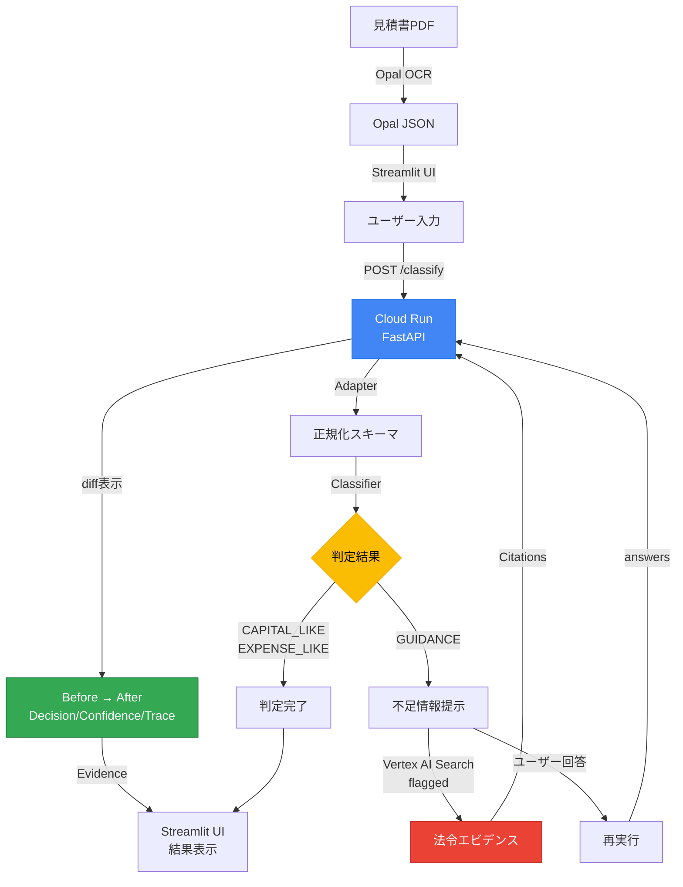
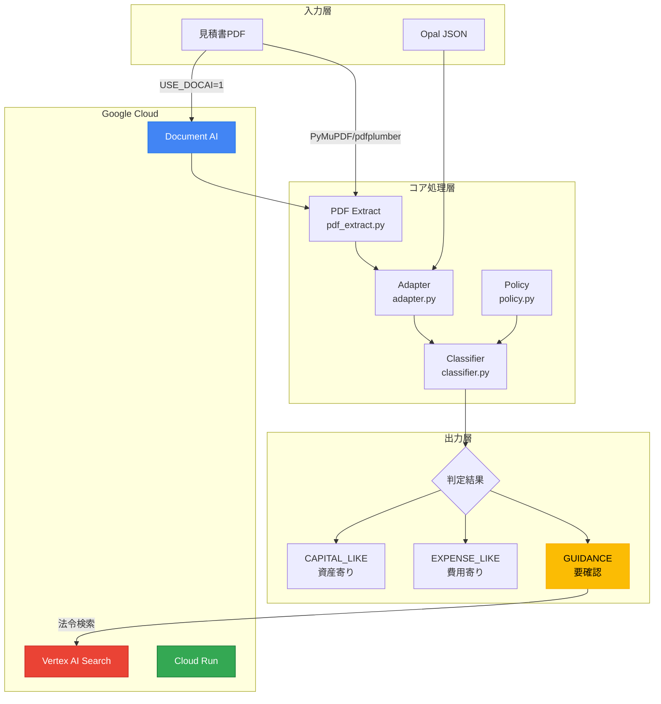
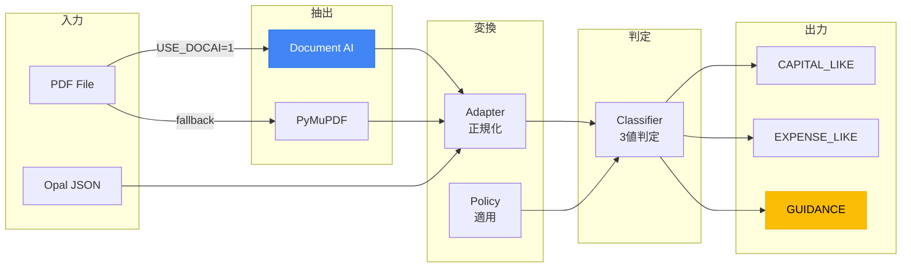
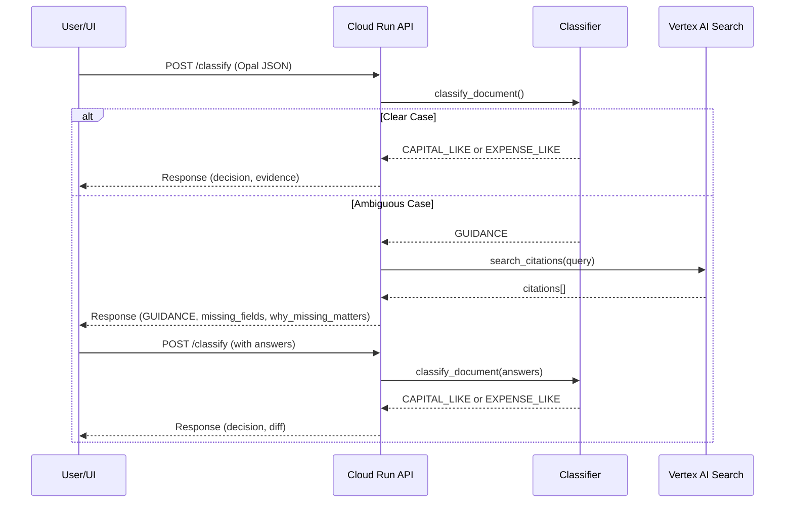
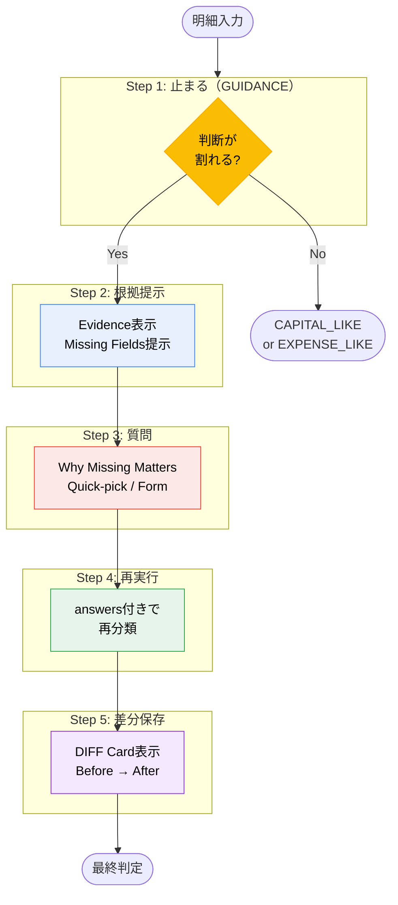
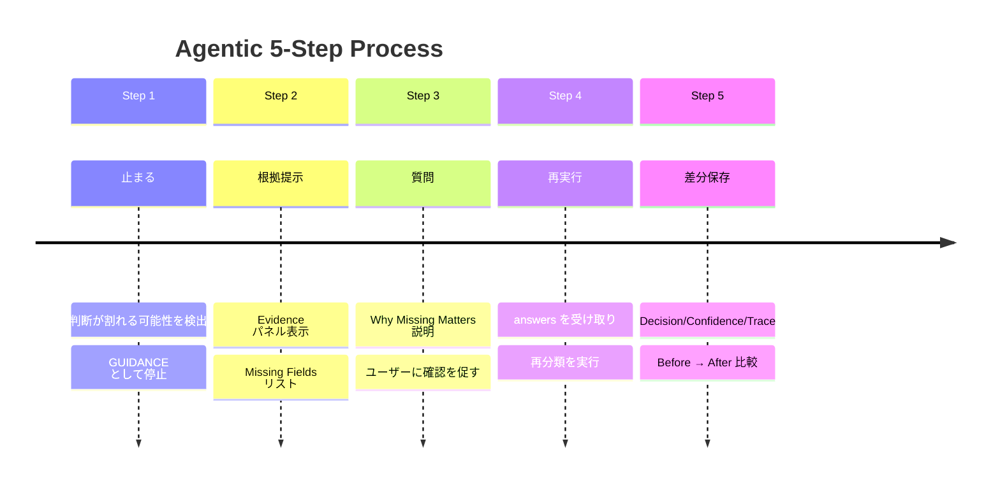
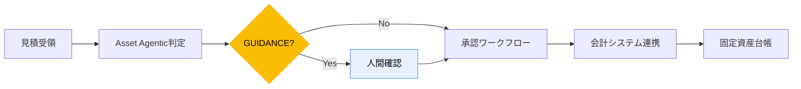
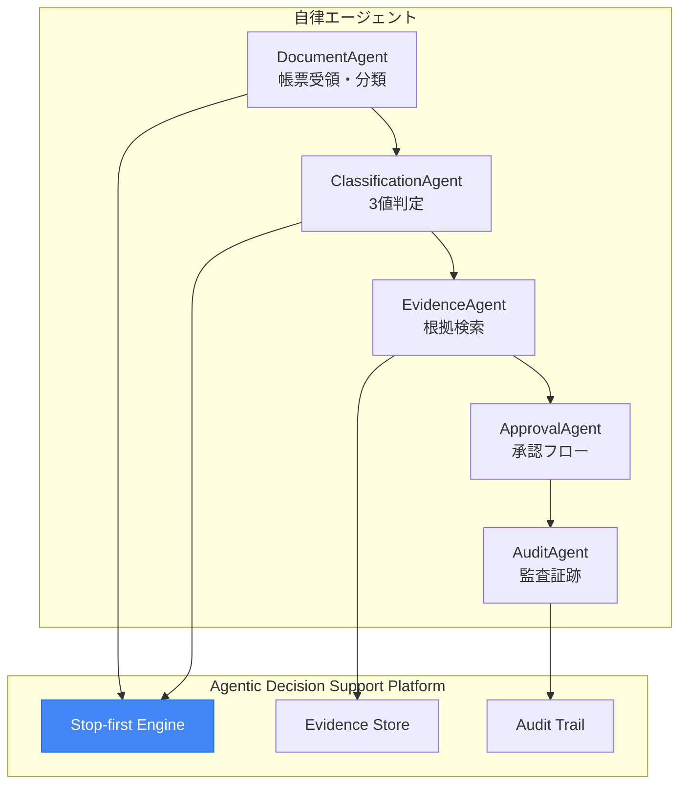
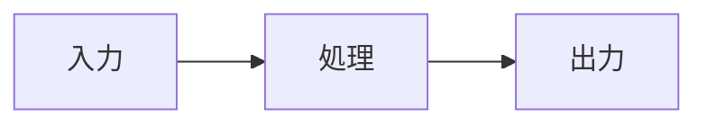
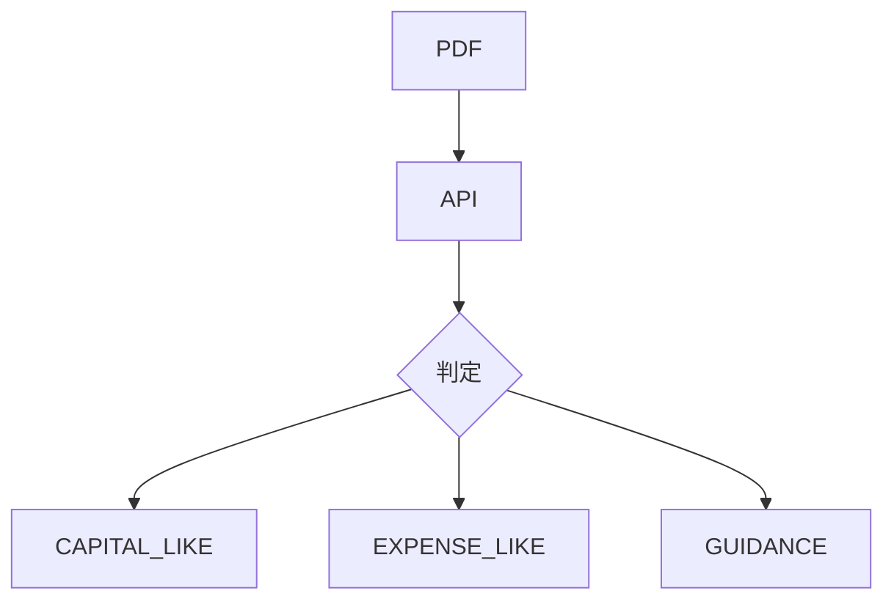

# Architecture Diagrams - Image Generation Guide

> **Purpose**: Convert Mermaid diagrams to images for presentations, Zenn articles, and documentation
> **Version**: 1.0.0
> **Last Updated**: 2026-01-30

---

## Table of Contents

1. [Image Generation Methods](#1-image-generation-methods)
2. [System Architecture Diagram](#2-system-architecture-diagram)
3. [Data Flow Diagram](#3-data-flow-diagram)
4. [Agentic 5-Step Process Diagram](#4-agentic-5-step-process-diagram)
5. [Workflow Integration Diagram](#5-workflow-integration-diagram)
6. [Recommended Formats](#6-recommended-formats)
7. [Zenn Article Embedding](#7-zenn-article-embedding)

---

## 1. Image Generation Methods

### Method 1: Mermaid Live Editor (Recommended for Quick Export)

**URL**: https://mermaid.live/

**Steps**:
1. Open https://mermaid.live/ in browser
2. Paste Mermaid code into the editor
3. Click "Actions" menu (top right)
4. Select "PNG" or "SVG" to download

**Pros**: No installation required, instant preview
**Cons**: Manual process for each diagram

### Method 2: mermaid-cli (Recommended for Automation)

**Installation**:
```bash
npm install -g @mermaid-js/mermaid-cli
```

**Usage**:
```bash
# Single file conversion
mmdc -i diagram.mmd -o diagram.png -b transparent

# With custom theme
mmdc -i diagram.mmd -o diagram.svg -t dark

# Batch conversion
for f in *.mmd; do mmdc -i "$f" -o "${f%.mmd}.png"; done
```

**Options**:
| Flag | Description | Example |
|------|-------------|---------|
| `-i` | Input file | `-i arch.mmd` |
| `-o` | Output file | `-o arch.png` |
| `-t` | Theme (default/dark/forest/neutral) | `-t dark` |
| `-b` | Background color | `-b transparent` |
| `-w` | Width in pixels | `-w 1200` |
| `-H` | Height in pixels | `-H 800` |

### Method 3: draw.io (For Custom Designs)

**URL**: https://app.diagrams.net/ or Desktop app

**Steps**:
1. Open draw.io
2. Create new diagram
3. Use shapes from "Software" or "GCP" libraries
4. Export as PNG/SVG (File > Export as)

**Pros**: Full design control, GCP official icons available
**Cons**: Manual drawing required

### Method 4: VS Code Extension

**Extension**: "Markdown Preview Mermaid Support" or "Mermaid Markdown Syntax Highlighting"

**Export**: Use "Markdown PDF" extension to export with rendered diagrams

---

## 2. System Architecture Diagram

### 2.1 Full System Architecture (README.md)



**Export filename**: `architecture_full.png` or `architecture_full.svg`

### 2.2 Layered Architecture (technical_explanation.md)



**Export filename**: `architecture_layered.png` or `architecture_layered.svg`

---

## 3. Data Flow Diagram

### 3.1 Processing Pipeline



**Export filename**: `dataflow_pipeline.png`

### 3.2 API Request/Response Flow



**Export filename**: `dataflow_sequence.png`

---

## 4. Agentic 5-Step Process Diagram

### 4.1 Flowchart Version



**Export filename**: `agentic_5step_flow.png`

### 4.2 Timeline Version



**Export filename**: `agentic_5step_timeline.png`

---

## 5. Workflow Integration Diagram

### 5.1 Business Process Integration



**Export filename**: `workflow_integration.png`

### 5.2 Multi-Agent Future Vision



**Export filename**: `workflow_multiagent.png`

---

## 6. Recommended Formats

### 6.1 Format Comparison

| Format | Use Case | Pros | Cons |
|--------|----------|------|------|
| **PNG** | Presentation, Web | Universal support, raster quality | No scaling |
| **SVG** | Web, High-DPI | Scalable, small file size | IE11 issues |
| **PDF** | Print, Documentation | High quality print | Not web-friendly |

### 6.2 Recommended Settings

**For Presentations (PowerPoint/Google Slides)**:
- Format: PNG
- Width: 1920px (Full HD)
- Background: White or Transparent
- DPI: 150

**For Web/Zenn Articles**:
- Format: SVG (preferred) or PNG
- Width: 800-1200px
- Background: Transparent
- Optimize: Use SVGO for SVG, TinyPNG for PNG

**For Print/PDF**:
- Format: SVG or PDF
- DPI: 300
- Background: White

### 6.3 Export Commands (mermaid-cli)

```bash
# Presentation quality (PNG)
mmdc -i diagram.mmd -o diagram.png -w 1920 -b white

# Web quality (SVG)
mmdc -i diagram.mmd -o diagram.svg -b transparent

# High-DPI (PNG 2x)
mmdc -i diagram.mmd -o diagram@2x.png -w 2400 -b transparent
```

---

## 7. Zenn Article Embedding

### 7.1 Method A: Direct Mermaid (Recommended)

Zenn natively supports Mermaid. Use fenced code blocks:

~~~markdown

~~~

**Pros**: No image hosting needed, always up-to-date
**Cons**: Limited styling control

### 7.2 Method B: Image Embedding

Upload images to Zenn or external hosting:

```markdown

*Figure 1: System Architecture Overview*
```

**Zenn Image Upload**:
1. Drag & drop image in Zenn editor
2. Image is hosted on Zenn CDN
3. URL format: `https://storage.googleapis.com/zenn-user-upload/...`

### 7.3 Method C: GitHub Raw URL

Host images in GitHub repository:

```markdown

```

### 7.4 Best Practices for Zenn

1. **Use Mermaid directly** for simple diagrams
2. **Use images** for complex diagrams or custom styling
3. **Add alt text** for accessibility
4. **Include figure captions** for context
5. **Keep image width under 800px** for mobile readability

### 7.5 Example Zenn Article Structure

```markdown
# Fixed Asset Agentic System

## システム構成

Asset Agenticは以下の構成で動作します。



## Agentic 5-Step Process


*Figure 2: GUIDANCE発生時の5ステップ処理フロー*

詳細は以下の通りです...
```

---

## Appendix: File Naming Convention

| Diagram Type | Filename Pattern | Example |
|--------------|------------------|---------|
| Architecture | `architecture_{variant}.{ext}` | `architecture_full.svg` |
| Data Flow | `dataflow_{type}.{ext}` | `dataflow_pipeline.png` |
| Agentic Process | `agentic_{variant}.{ext}` | `agentic_5step_flow.png` |
| Workflow | `workflow_{context}.{ext}` | `workflow_integration.svg` |

**Recommended directory structure**:
```
docs/
├── images/
│   ├── architecture_full.svg
│   ├── architecture_layered.png
│   ├── dataflow_pipeline.png
│   ├── agentic_5step_flow.png
│   └── workflow_integration.svg
└── architecture_diagram.md  (this file)
```

---

*Generated for: 第4回 Agentic AI Hackathon with Google Cloud*
