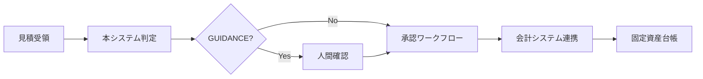

# 将来ビジョン: Fixed Asset Agentic System

> **Version**: 1.0.0
> **Last Updated**: 2026-01-30
> **Status**: Strategic Planning Document

---

## 1. 現状の位置づけ

### 1.1 MVP/POC としての本システム

本システムは **第4回 Agentic AI Hackathon with Google Cloud** 向けに開発された Proof of Concept（POC）である。

#### 実証済みの価値
- **Stop-first設計**: AIが判断を「行う／止める」を自律的に選択する設計パターンの実証
- **3値判定モデル**: CAPITAL_LIKE / EXPENSE_LIKE / GUIDANCE による段階的判定
- **人間協働型AI**: 判断が割れる場面で自動化を止め、人間の判断を支援

#### 現在の制約
| 項目 | 現状 | 将来目標 |
|------|------|----------|
| 対応帳票 | 見積書のみ | 請求書・領収書・注文書 |
| 判定範囲 | 固定資産/費用の分類 | 耐用年数・減価償却 |
| OCR | Opal依存 | Document AI本格活用 |
| 法令検索 | Feature-flagged | 本格統合 |
| 運用環境 | Cloud Run (単一インスタンス) | マルチリージョン・高可用性 |

---

## 2. 短期ロードマップ（3-6ヶ月）

### Phase 1: 基盤安定化（1-2ヶ月）

#### 2.1.1 Document AI 本格統合
```
目標: USE_DOCAI=1 をデフォルト化
- PDFレイアウト解析の精度向上
- テーブル構造の自動抽出
- 手書き文字認識（OCR精度向上）
```

#### 2.1.2 Vertex AI Search 常時有効化
```
目標: 法令エビデンス検索の常時利用
- 税法・会計基準のベクトル検索
- 判定根拠の自動引用
- Citations の精度向上
```

#### 2.1.3 テスト・品質基盤
- Golden Set の拡充（10 → 50ケース）
- E2Eテストの自動化
- 本番環境モニタリング

### Phase 2: 機能拡張（3-4ヶ月）

#### 2.2.1 耐用年数マスタ連携
```yaml
# 想定インターフェース
useful_life_master:
  source: "減価償却資産の耐用年数等に関する省令"
  lookup_by:
    - asset_category
    - structure_or_use
  output:
    - useful_life_years
    - depreciation_method
    - confidence_score
```

**重要**: Stop-first設計を維持。耐用年数の自動決定ではなく、候補提示と根拠提示に留める。

#### 2.2.2 会社別ポリシー拡張
- 現在: `policies/company_default.json`
- 拡張: マルチテナント対応（会社コード別ポリシー）
- 上場企業向け: 四半期決算対応フラグ

### Phase 3: 運用成熟（5-6ヶ月）

#### 2.3.1 監査証跡の強化
```
要件:
- 全判定のトレースログ永続化
- 人間による上書き判定の記録
- 監査人向けエクスポート機能
```

#### 2.3.2 ユーザーフィードバックループ
- GUIDANCE → 人間判定 → フィードバック収集
- 判定精度の継続的改善
- ただし、前例踏襲による思考停止リスクに注意

---

## 3. 中期ロードマップ（1-2年）

### 3.1 他帳票への横展開

| 帳票種別 | 判定内容 | Stop条件 |
|----------|----------|----------|
| **請求書** | 支払承認/保留/要確認 | 金額差異・未承認ベンダー |
| **領収書** | 経費精算可否 | 社内規定逸脱・重複疑い |
| **注文書** | 予算整合性 | 予算超過・承認フロー未完了 |
| **契約書** | リース/購入判定 | IFRS16適用判断 |

**設計原則**: 各帳票でも Stop-first 設計を維持。自動処理と人間確認の境界を明確化。

### 3.2 マルチモーダル対応

```
拡張計画:
1. 写真撮影 → 資産現物確認
2. 音声入力 → 現場からの補足情報
3. 図面/CAD → 設備投資の規模判定
```

### 3.3 ワークフロー統合



**統合候補**:
- 経費精算システム（SAP Concur, 楽楽精算等）
- 会計システム（勘定奉行, freee会計等）
- 固定資産管理システム（ProPlus, 固定資産奉行等）

### 3.4 グローバル対応

| リージョン | 対応内容 | 優先度 |
|------------|----------|--------|
| 日本 | 現行（日本基準/IFRS選択） | 実装済 |
| 北米 | US GAAP / ASC 842 | 高 |
| EU | IFRS 16 / 各国GAAP | 中 |
| アジア | 各国基準対応 | 低 |

---

## 4. 長期ビジョン（3年以上）

### 4.1 「判断支援AI」のプラットフォーム化

本システムの核心である **Stop-first設計** は、固定資産判定に限らず、あらゆる業務判断に適用可能なパターンである。

```
プラットフォーム化の方向性:
┌─────────────────────────────────────────────────┐
│         Agentic Decision Support Platform       │
├─────────────────────────────────────────────────┤
│  ┌───────────┐ ┌───────────┐ ┌───────────┐     │
│  │ 固定資産  │ │ 与信判定  │ │ 採用判定  │ ... │
│  │ 判定      │ │           │ │           │     │
│  └───────────┘ └───────────┘ └───────────┘     │
├─────────────────────────────────────────────────┤
│  共通基盤: Stop-first Engine / Evidence Store   │
│            Audit Trail / Human-in-the-Loop     │
└─────────────────────────────────────────────────┘
```

### 4.2 自律エージェント連携

```yaml
future_agent_ecosystem:
  - agent: "DocumentAgent"
    role: "帳票受領・分類・正規化"
  - agent: "ClassificationAgent"
    role: "3値判定・GUIDANCE生成"
  - agent: "EvidenceAgent"
    role: "法令・社内規定の根拠検索"
  - agent: "ApprovalAgent"
    role: "承認フロー管理・エスカレーション"
  - agent: "AuditAgent"
    role: "監査証跡・コンプライアンス確認"
```

### 4.3 業界標準への貢献

- **Stop-first設計のOSS化**: 判断支援AIのベストプラクティスとして公開
- **監査対応ガイドライン**: AI判定と人間判定の責任分界点の標準化
- **学術研究連携**: Human-AI Collaboration の実証研究

---

## 5. 拡張可能な機能

### 5.1 即座に拡張可能（設計済み）

| 機能 | 現状 | 拡張方法 |
|------|------|----------|
| Policy Hook | JSON設定 | YAML/DB化 |
| Vertex Search | Feature-flagged | フラグ常時ON |
| PDF処理 | PyMuPDF/Document AI | Document AI専用化 |

### 5.2 設計変更で拡張可能

| 機能 | 必要な変更 | 工数目安 |
|------|------------|----------|
| マルチテナント | 認証基盤追加 | 中 |
| バッチ処理 | Cloud Tasks連携 | 小 |
| 非同期処理 | Pub/Sub導入 | 中 |

### 5.3 新規開発が必要

| 機能 | 依存関係 | 工数目安 |
|------|----------|----------|
| 会計システム連携 | 各社API調査 | 大 |
| 監査証跡ダッシュボード | フロントエンド開発 | 中 |
| グローバル会計基準 | 法令DB構築 | 大 |

---

## 6. 他システムとの連携可能性

### 6.1 Google Cloud エコシステム

```
現在の活用:
├── Cloud Run (API ホスティング)
├── Document AI (PDF抽出) - Feature-flagged
└── Vertex AI Search (法令検索) - Feature-flagged

拡張可能:
├── BigQuery (分析・BI連携)
├── Cloud Pub/Sub (イベント駆動)
├── Cloud Tasks (バッチ処理)
├── Cloud Functions (軽量処理)
├── Looker (ダッシュボード)
└── AlloyDB (トランザクションDB)
```

### 6.2 外部システム連携

| カテゴリ | システム例 | 連携方式 |
|----------|------------|----------|
| **OCR** | Opal, ABBYY, AWS Textract | API連携 |
| **会計** | SAP, Oracle, freee | REST/Webhook |
| **ワークフロー** | ServiceNow, kintone | イベント連携 |
| **ストレージ** | Box, Google Drive, SharePoint | ファイル監視 |
| **コミュニケーション** | Slack, Teams | 通知連携 |

### 6.3 API設計方針

```yaml
api_principles:
  - RESTful: 現在の /classify エンドポイント維持
  - Webhook: 判定完了時のコールバック
  - Batch: 複数帳票の一括処理
  - Streaming: 大量データのストリーム処理

versioning:
  strategy: "URI versioning (/v1/, /v2/)"
  backward_compatibility: "2バージョン保証"
```

---

## 7. ビジネスモデルの展望

### 7.1 想定顧客セグメント

| セグメント | 特徴 | 提供価値 |
|------------|------|----------|
| **中堅企業** | 経理人員2-5名、月100-500件処理 | 判定効率化・属人化解消 |
| **大企業** | 月1000件以上、監査対応必須 | 監査証跡・ガバナンス強化 |
| **会計事務所** | 複数クライアント対応 | マルチテナント・標準化 |
| **SIer/コンサル** | 顧客への提案材料 | ホワイトラベル提供 |

### 7.2 収益モデル案

```
Option A: SaaS月額課金
├── Basic: ¥50,000/月 (500件/月まで)
├── Professional: ¥150,000/月 (2000件/月まで)
└── Enterprise: 個別見積 (無制限 + SLA)

Option B: 従量課金
├── 判定単価: ¥100/件
├── GUIDANCE発生時: ¥150/件 (根拠提示含む)
└── 月間最低利用料: ¥30,000

Option C: ライセンス販売
├── オンプレミス導入: 初期費用 + 年間保守
└── プライベートクラウド: 構築費用 + 運用サポート
```

### 7.3 競合優位性

| 観点 | 従来型AI自動化 | 本システム (Stop-first) |
|------|----------------|------------------------|
| **判定方式** | 全自動（強制判定） | 3値判定（止まれる） |
| **責任境界** | 曖昧 | 明確（人間/AI分界点） |
| **監査対応** | 事後説明困難 | 判定根拠トレース可能 |
| **導入リスク** | 高（誤判定リスク） | 低（不明時は停止） |

### 7.4 Go-to-Market 戦略

```
Phase 1 (6ヶ月): Early Adopter獲得
├── ハッカソン受賞による認知獲得
├── 無料トライアル提供
└── 事例作成（2-3社）

Phase 2 (12ヶ月): 市場浸透
├── パートナー経由販売
├── 会計事務所向けセミナー
└── 導入事例の横展開

Phase 3 (24ヶ月): スケール
├── エンタープライズ営業
├── グローバル展開
└── プラットフォーム化
```

---

## 8. リスクと対策

### 8.1 技術リスク

| リスク | 影響度 | 対策 |
|--------|--------|------|
| OCR精度低下 | 高 | Document AI本格採用 |
| 法改正追従遅れ | 高 | Vertex Search更新体制 |
| スケーラビリティ | 中 | Cloud Runオートスケール |

### 8.2 ビジネスリスク

| リスク | 影響度 | 対策 |
|--------|--------|------|
| 競合参入 | 高 | Stop-first設計の差別化 |
| 法規制変更 | 中 | コンプライアンス監視 |
| 価格競争 | 中 | 付加価値サービス強化 |

### 8.3 運用リスク

| リスク | 影響度 | 対策 |
|--------|--------|------|
| システム障害 | 高 | SLA設計・冗長化 |
| セキュリティ | 高 | SOC2対応・暗号化 |
| 人材確保 | 中 | ナレッジ文書化 |

---

## 9. 成功指標（KPI）

### 9.1 短期KPI（6ヶ月）

| 指標 | 目標 | 測定方法 |
|------|------|----------|
| Golden Set精度 | 95%以上維持 | 自動テスト |
| GUIDANCE発生率 | 20-30% | 本番ログ |
| API応答時間 | p99 < 3秒 | Cloud Monitoring |

### 9.2 中期KPI（1年）

| 指標 | 目標 | 測定方法 |
|------|------|----------|
| 導入企業数 | 10社 | 契約数 |
| 月間処理件数 | 10,000件 | 利用ログ |
| 顧客満足度 | NPS > 40 | アンケート |

### 9.3 長期KPI（3年）

| 指標 | 目標 | 測定方法 |
|------|------|----------|
| ARR | ¥100M | 財務 |
| 市場シェア | 対象市場5% | 調査 |
| 横展開帳票数 | 5種類 | 機能リリース |

---

## 付録: 参考資料

### A. 関連ドキュメント
- [README.md](../README.md): プロジェクト概要
- [INDEX.md](../INDEX.md): 開発ルール
- [COMPLIANCE_CHECKLIST.md](./COMPLIANCE_CHECKLIST.md): 規約準拠チェック
- [DEMO_RUNBOOK.md](./DEMO_RUNBOOK.md): デモ手順

### B. 外部参照
- 減価償却資産の耐用年数等に関する省令
- IFRS 16 リース会計基準
- US GAAP ASC 842

---

*本ドキュメントは戦略的計画文書であり、市場環境や技術動向に応じて更新される。*
