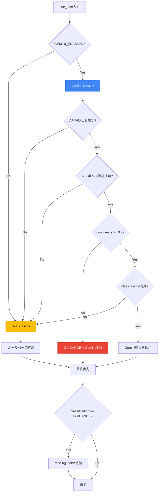

# Gemini API 統合設計書

> **タスクID**: subtask_004_01
> **緊急度**: 高（提出要件違反対応）
> **作成日**: 2026-01-30

---

## 背景と目的

### 問題
現在の `core/classifier.py` は**完全にルールベース**（キーワードマッチング + 金額閾値）であり、Gemini API を使用していない。

### ハッカソン提出要件
> Google Cloud AIサービスとして以下から1つ以上の使用が必要:
> - Vertex AI
> - **Gemini API in Vertex AI** ← これを追加
> - Google Agentspace
> - Vertex AI Agent Builder
> - Agent Development Kit

### 目的
Gemini API を統合し、**AIらしい判断**を追加する。ただし Stop-first 原則は維持。

---

## 現行アーキテクチャ分析

### core/classifier.py の構造

```
入力: line_item (description, amount)
  ↓
1. キーワードマッチング
   - CAPITAL_KEYWORDS → CAPITAL_LIKE
   - EXPENSE_KEYWORDS → EXPENSE_LIKE
   - MIXED_KEYWORDS → GUIDANCE
  ↓
2. ポリシー適用
   - always_guidance regex
   - guidance_add keywords
  ↓
3. 税務ルール適用
   - 10万/20万/30万/60万 閾値
  ↓
出力: classification, label_ja, rationale_ja, flags
```

### 強み（維持すべき点）
- 3値分類（CAPITAL_LIKE / EXPENSE_LIKE / GUIDANCE）
- Stop-first 原則（判断が割れたら GUIDANCE）
- 税務ルールの明示的適用
- ポリシーによるカスタマイズ

### 弱み（Geminiで補完すべき点）
- キーワードに依存（未知の表現に弱い）
- 文脈理解がない
- 判断根拠が機械的

---

## 統合アーキテクチャ設計

### 基本方針

```
┌─────────────────────────────────────────────────────┐
│                   classify_line_item                 │
├─────────────────────────────────────────────────────┤
│  GEMINI_ENABLED=1?                                  │
│       │                                             │
│       ├─ Yes ─→ gemini_classify()                   │
│       │              │                              │
│       │              ├─ Success → Gemini結果を採用   │
│       │              │                              │
│       │              └─ Failure → rule_classify()   │
│       │                         (フォールバック)     │
│       │                                             │
│       └─ No ──→ rule_classify()                     │
│                 (従来のルールベース)                  │
└─────────────────────────────────────────────────────┘
```

### Feature Flag 設計

```python
# 環境変数
GEMINI_ENABLED=1          # Gemini分類を有効化
GEMINI_PROJECT_ID=xxx     # GCPプロジェクトID
GEMINI_LOCATION=asia-northeast1  # リージョン
GEMINI_MODEL=gemini-2.0-flash    # モデル名
```

### フォールバック設計

| 状況 | 動作 |
|------|------|
| GEMINI_ENABLED=0 | ルールベースのみ使用 |
| Gemini API エラー | ルールベースにフォールバック |
| Gemini レスポンス解析失敗 | ルールベースにフォールバック |
| 信頼度が低い | GUIDANCE として返却 |

---

## Gemini プロンプト設計

### システムプロンプト

```
あなたは日本の経理業務に精通した固定資産判定の専門家です。

【重要な原則】
- 判断が曖昧な場合は必ず GUIDANCE を選択してください
- 断定的な判断を避け、人間の確認を促す設計です
- 情報が不足している場合も GUIDANCE を選択してください

【分類ルール】
- CAPITAL_LIKE: 資産計上が妥当と判断される場合
  - 新規取得、設置工事、増設、改良工事など
- EXPENSE_LIKE: 費用処理が妥当と判断される場合
  - 保守点検、修理、清掃、消耗品など
- GUIDANCE: 判断が割れる可能性がある場合（最重要）
  - 撤去、移設、既設設備、一式工事
  - 金額が10万〜60万円の範囲（税務判定が複雑）
  - 情報が不足している場合

【出力形式】
以下のJSON形式で回答してください:
{
  "classification": "CAPITAL_LIKE" | "EXPENSE_LIKE" | "GUIDANCE",
  "confidence": 0.0〜1.0,
  "rationale_ja": "判断理由（日本語）",
  "missing_fields": ["不足している情報のリスト"],
  "why_missing_matters": "なぜその情報が必要か"
}
```

### ユーザープロンプト

```
以下の見積書明細を分類してください。

【明細情報】
品名・内容: {description}
金額: {amount}円
数量: {quantity}
備考: {remarks}

【追加コンテキスト】
取引先: {vendor}
案件名: {project_name}

判断が曖昧な場合は GUIDANCE を選択し、確認すべきポイントを明示してください。
```

---

## 統合フロー図



---

## 実装設計

### 新規ファイル: `core/gemini_classifier.py`

```python
# -*- coding: utf-8 -*-
"""
Gemini API integration for fixed asset classification.
Feature-flagged: Only active when GEMINI_ENABLED=1.
"""
import json
import os
from typing import Any, Dict, Optional

from core import schema


def _bool_env(name: str, default: bool = False) -> bool:
    val = os.getenv(name)
    if val is None:
        return default
    return str(val).strip().lower() in {"1", "true", "yes"}


def _get_gemini_config() -> Dict[str, str]:
    return {
        "project_id": os.getenv("GEMINI_PROJECT_ID", os.getenv("GOOGLE_CLOUD_PROJECT", "")),
        "location": os.getenv("GEMINI_LOCATION", "asia-northeast1"),
        "model": os.getenv("GEMINI_MODEL", "gemini-2.0-flash"),
    }


SYSTEM_PROMPT = """あなたは日本の経理業務に精通した固定資産判定の専門家です。

【重要な原則】
- 判断が曖昧な場合は必ず GUIDANCE を選択してください
- 断定的な判断を避け、人間の確認を促す設計です

【分類ルール】
- CAPITAL_LIKE: 資産計上が妥当（新規取得、設置工事、増設など）
- EXPENSE_LIKE: 費用処理が妥当（保守点検、修理、清掃など）
- GUIDANCE: 判断が割れる可能性がある場合

【出力形式】JSON:
{"classification": "...", "confidence": 0.0-1.0, "rationale_ja": "...", "missing_fields": [...], "why_missing_matters": "..."}
"""


def classify_with_gemini(
    item: Dict[str, Any],
    doc: Optional[Dict[str, Any]] = None,
) -> Optional[Dict[str, Any]]:
    """
    Classify line item using Gemini API.
    Returns None if disabled or failed (for fallback to rule-based).
    """
    if not _bool_env("GEMINI_ENABLED", False):
        return None

    config = _get_gemini_config()
    if not config["project_id"]:
        return None

    try:
        import vertexai
        from vertexai.generative_models import GenerativeModel

        vertexai.init(project=config["project_id"], location=config["location"])
        model = GenerativeModel(config["model"], system_instruction=SYSTEM_PROMPT)

        # Build user prompt
        description = item.get("description", "")
        amount = item.get("amount", 0)
        quantity = item.get("quantity", 1)

        user_prompt = f"""以下の見積書明細を分類してください。

品名・内容: {description}
金額: {amount}円
数量: {quantity}

判断が曖昧な場合は GUIDANCE を選択してください。"""

        response = model.generate_content(user_prompt)

        # Parse JSON response
        text = response.text.strip()
        # Handle markdown code blocks
        if text.startswith("```"):
            text = text.split("```")[1]
            if text.startswith("json"):
                text = text[4:]

        result = json.loads(text)

        # Validate classification
        classification = result.get("classification", "").upper()
        if classification not in [schema.CAPITAL_LIKE, schema.EXPENSE_LIKE, schema.GUIDANCE]:
            return None

        # Low confidence -> GUIDANCE
        confidence = float(result.get("confidence", 0.5))
        if confidence < 0.7:
            classification = schema.GUIDANCE

        return {
            "classification": classification,
            "confidence": confidence,
            "rationale_ja": result.get("rationale_ja", "Geminiによる判定"),
            "missing_fields": result.get("missing_fields", []),
            "why_missing_matters": result.get("why_missing_matters", ""),
            "source": "gemini",
        }

    except ImportError:
        return None
    except json.JSONDecodeError:
        return None
    except Exception:
        return None
```

### 既存ファイル修正: `core/classifier.py`

```python
# 追加インポート
from core.gemini_classifier import classify_with_gemini

def classify_line_item(
    item: Dict[str, Any],
    policy: Optional[Dict[str, Any]] = None,
    doc: Optional[Dict[str, Any]] = None,
) -> Dict[str, Any]:

    # Gemini分類を試行（有効な場合のみ）
    gemini_result = classify_with_gemini(item, doc)

    if gemini_result is not None:
        # Gemini結果を採用
        classification = gemini_result["classification"]
        rationale_ja = gemini_result["rationale_ja"]
        flags = [f"gemini:confidence={gemini_result['confidence']:.2f}"]

        # missing_fields があれば追加
        if gemini_result.get("missing_fields"):
            item["missing_fields"] = gemini_result["missing_fields"]
            item["why_missing_matters"] = gemini_result.get("why_missing_matters", "")
    else:
        # ルールベース分類（既存ロジック）
        # ... 既存コードをそのまま維持 ...
```

---

## 実装手順

### Phase 1: 基盤実装（足軽2担当）

1. `core/gemini_classifier.py` を新規作成
2. `requirements.txt` に依存追加
   ```
   google-cloud-aiplatform>=1.38.0
   ```
3. 単体テスト作成 `tests/test_gemini_classifier.py`

### Phase 2: 統合（足軽2担当）

4. `core/classifier.py` に Gemini 呼び出しを追加
5. フォールバックロジックの実装
6. 統合テスト作成

### Phase 3: 検証（足軽3担当）

7. Golden Set での精度検証
8. Cloud Run での動作確認
9. デモ用サンプルでの検証

---

## テスト戦略

### 単体テスト

```python
# tests/test_gemini_classifier.py
import os
import pytest
from unittest.mock import patch, MagicMock

from core.gemini_classifier import classify_with_gemini

def test_disabled_returns_none():
    """GEMINI_ENABLED=0 の場合は None を返す"""
    with patch.dict(os.environ, {"GEMINI_ENABLED": "0"}):
        result = classify_with_gemini({"description": "テスト"})
        assert result is None

def test_fallback_on_error():
    """API エラー時は None を返す（フォールバック用）"""
    with patch.dict(os.environ, {"GEMINI_ENABLED": "1", "GEMINI_PROJECT_ID": "test"}):
        with patch("vertexai.init", side_effect=Exception("API Error")):
            result = classify_with_gemini({"description": "テスト"})
            assert result is None

def test_low_confidence_becomes_guidance():
    """信頼度が低い場合は GUIDANCE になる"""
    # モック応答で confidence=0.5 を返す
    # → classification は GUIDANCE になるべき
```

### 統合テスト

```python
# tests/test_classifier_integration.py
def test_gemini_fallback_to_rules():
    """Gemini失敗時にルールベースにフォールバックする"""
    with patch.dict(os.environ, {"GEMINI_ENABLED": "1"}):
        with patch("core.gemini_classifier.classify_with_gemini", return_value=None):
            result = classify_line_item({"description": "サーバー新設工事", "amount": 500000})
            assert result["classification"] == "CAPITAL_LIKE"
            assert "gemini" not in str(result.get("flags", []))
```

---

## 環境変数一覧

| 変数名 | 必須 | デフォルト | 説明 |
|--------|------|-----------|------|
| `GEMINI_ENABLED` | No | `0` | Gemini分類の有効化 |
| `GEMINI_PROJECT_ID` | No | `GOOGLE_CLOUD_PROJECT` | GCPプロジェクトID |
| `GEMINI_LOCATION` | No | `asia-northeast1` | Vertex AIリージョン |
| `GEMINI_MODEL` | No | `gemini-2.0-flash` | 使用モデル |

---

## リスクと対策

| リスク | 影響 | 対策 |
|--------|------|------|
| Gemini API レート制限 | 大量処理時に失敗 | フォールバック + リトライ |
| レスポンス遅延 | UX低下 | タイムアウト設定（10秒） |
| 予期しない出力形式 | 解析失敗 | JSON解析エラー時はフォールバック |
| コスト増加 | API課金 | GEMINI_ENABLED でオプトイン |

---

## 審査員へのアピールポイント

1. **Gemini 活用**: 提出要件を満たす
2. **Stop-first 原則**: 低信頼度 → GUIDANCE
3. **フォールバック設計**: 堅牢性
4. **Feature Flag**: 段階的導入可能

---

*設計者: Ashigaru-1*
*実装担当: Ashigaru-2（予定）*
*Last Updated: 2026-01-30*
