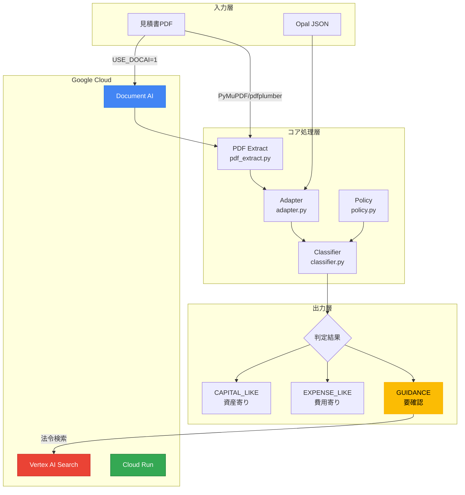

# 固定資産判定システム 技術説明ドキュメント

> **Zenn記事向け技術素材**
> Version: 1.0.0 | Last Updated: 2026-01-30

## 1. アーキテクチャ概要

Asset Agenticは「Stop-first（判断を止める）」設計を核とするAgentic AIアーキテクチャを採用しています。

### 1.1 設計思想

従来のAI自動化システムが「すべてを自動処理する」ことを目指すのに対し、Asset Agenticは**「判断が難しい場面では自律的に停止し、人間の判断を促す」**という協働型アプローチを取っています。

```
┌────────────────────────────────────────────────────────────┐
│                    Agentic AI の定義                        │
│                                                            │
│  自律 ≠ すべてを自動化すること                              │
│  自律 = 判断を「行う」か「止める」かを選択できること          │
└────────────────────────────────────────────────────────────┘
```

### 1.2 システム構成図



### 1.3 モジュール構成

```
core/
├── schema.py        # 凍結スキーマ v1.0 定義
├── adapter.py       # Opal JSON → 正規化スキーマ変換
├── classifier.py    # 3値判定ロジック（Stop-first設計）
├── policy.py        # 会社別ポリシー読み込み
├── pipeline.py      # パイプライン統合
└── pdf_extract.py   # PDF抽出（DocAI/PyMuPDF/pdfplumber）

api/
├── main.py              # FastAPI エンドポイント
├── gemini_classifier.py # Gemini 3 Pro 分類判定
├── gemini_splitter.py   # Gemini 2.0 Flash PDF分割
├── vertex_search.py     # Vertex AI Search 法令検索
├── useful_life_estimator.py # 法定耐用年数推定
├── history_search.py    # 過去判定履歴検索
├── similarity_search.py # 類似事例検索
└── embedding_store.py   # 埋め込みストア
```

## 2. 使用技術スタック

### 2.1 バックエンド

| カテゴリ | 技術 | 用途 |
|---------|------|------|
| フレームワーク | FastAPI | REST API サーバー |
| データ検証 | Pydantic | リクエスト/レスポンススキーマ |
| サーバー | Uvicorn / Gunicorn | ASGI/WSGI サーバー |

### 2.2 PDF処理

| 技術 | 用途 | 条件 |
|------|------|------|
| Google Document AI | 高精度PDF抽出 | `USE_DOCAI=1` |
| PyMuPDF (fitz) | ローカルPDF抽出 | フォールバック |
| pdfplumber | テーブル抽出補助 | フォールバック |
| Tesseract OCR | スキャンPDF対応 | `USE_LOCAL_OCR=1` |

### 2.3 Google Cloud

| サービス | 用途 | Feature Flag |
|---------|------|-------------|
| Gemini 3 Pro Preview | 固定資産判定（`thinking_level=HIGH`） | `GEMINI_ENABLED=1` |
| Gemini 2.0 Flash | PDF読み取り・文書分割（Vision API） | `GEMINI_PDF_ENABLED=1` |
| Cloud Run | API/UIホスティング（2サービス） | 常時有効 |
| Document AI | PDF → テキスト抽出 | `USE_DOCAI=1` |
| Vertex AI Search | 法令エビデンス検索 | `VERTEX_SEARCH_ENABLED=1` |

### 2.4 フロントエンド

| 技術 | 用途 |
|------|------|
| Streamlit | デモ用WebUI |

## 3. AI/ML判定ロジックの説明

### 3.1 3値判定システム

Asset Agenticは明細行を以下の3つの値で判定します：

```python
CAPITAL_LIKE = "CAPITAL_LIKE"  # 資産寄り
EXPENSE_LIKE = "EXPENSE_LIKE"  # 費用寄り
GUIDANCE = "GUIDANCE"          # 要確認（判定を停止）
```

### 3.2 キーワード検出ロジック

#### 資産寄りキーワード（CAPITAL_KEYWORDS）
```python
CAPITAL_KEYWORDS = [
    "更新", "新設", "設置", "増設", "購入",
    "導入", "構築", "整備", "改修"
]
```

#### 費用寄りキーワード（EXPENSE_KEYWORDS）
```python
EXPENSE_KEYWORDS = [
    "保守", "点検", "修理", "調整",
    "清掃", "清拭", "消耗品", "雑費"
]
```

#### 判断が割れるキーワード（MIXED_KEYWORDS）
```python
MIXED_KEYWORDS = [
    "一式", "撤去", "移設", "既設", "更新"
]
```

### 3.3 判定フロー

```
明細テキスト
    │
    ▼
┌───────────────┐
│ キーワード検出 │
└───────┬───────┘
        │
    ┌───┴───┐
    │       │
    ▼       ▼
MIXED検出?  両方検出?
    │           │
    ▼           ▼
   YES ───► GUIDANCE
    │
   NO
    │
    ▼
CAPITAL検出のみ? ─► CAPITAL_LIKE
    │
    ▼
EXPENSE検出のみ? ─► EXPENSE_LIKE
    │
    ▼
どちらもなし ───► GUIDANCE（no_keywords）
```

### 3.4 税務金額ルール

日本の固定資産税制に基づく金額閾値判定：

| 金額範囲 | ルールID | 判定 | 理由 |
|---------|---------|------|------|
| < 10万円 | R-AMOUNT-003 | 維持 | 少額固定資産（費用処理可能） |
| 10〜20万円 | R-AMOUNT-100k200k | GUIDANCE | 3年一括償却の確認必要 |
| 20〜30万円 | R-AMOUNT-001 / R-AMOUNT-SME300k | GUIDANCE | 一括償却/中小企業特例要確認 |
| 30〜60万円 | R-AMOUNT-001 | 維持 | 一括償却資産の取扱い |
| >= 60万円 | R-AMOUNT-600k | GUIDANCE | 修繕費vs資本的支出の判定必要 |

### 3.5 ポリシーによるカスタマイズ

会社固有のルールを `policies/company_default.json` で設定可能：

```json
{
  "keywords": {
    "asset_add": ["カスタム資産キーワード"],
    "expense_add": ["カスタム費用キーワード"],
    "guidance_add": ["常にGUIDANCEにするキーワード"]
  },
  "thresholds": {
    "guidance_amount_jpy": 500000
  },
  "regex": {
    "always_guidance": "特殊パターン.*正規表現"
  }
}
```

## 4. GCP活用方法

### 4.1 Document AI 統合

```python
# 環境変数設定
USE_DOCAI=1
GOOGLE_CLOUD_PROJECT=your-project-id
DOCAI_PROCESSOR_ID=your-processor-id
DOCAI_LOCATION=us  # または asia-northeast1
```

**処理フロー:**
1. PDF バイナリを Document AI に送信
2. OCR + レイアウト解析を実行
3. 構造化テキストを抽出
4. フォールバック時は PyMuPDF/pdfplumber を使用

### 4.2 Vertex AI Search 統合

法令・規則のエビデンス検索に Vertex AI Search（Discovery Engine）を活用：

```python
# 環境変数設定
VERTEX_SEARCH_ENABLED=1
GOOGLE_CLOUD_PROJECT=your-project-id
DISCOVERY_ENGINE_DATA_STORE_ID=your-data-store-id
```

**検索クエリ生成ロジック:**
```python
def get_citations_for_guidance(description, missing_fields, flags):
    query_parts = []

    # 明細キーワードを抽出
    keywords = extract_keywords(description)
    query_parts.extend(keywords[:3])

    # コンテキスト追加
    query_parts.append("固定資産 判定")

    # フラグに応じた検索語追加
    if "mixed_keyword" in flags:
        query_parts.append("修繕費 資本的支出")
    if "amount" in flags:
        query_parts.append("金額基準 20万円 60万円")

    return search_legal_citations(" ".join(query_parts))
```

### 4.3 Cloud Run デプロイ

```bash
# 1. 必要APIを有効化
gcloud services enable \
  run.googleapis.com \
  artifactregistry.googleapis.com \
  aiplatform.googleapis.com

# 2. ソースからデプロイ
gcloud run deploy fixed-asset-agentic-api \
  --source . \
  --region asia-northeast1 \
  --allow-unauthenticated \
  --set-env-vars "USE_DOCAI=1,VERTEX_SEARCH_ENABLED=1"
```

## 5. データフロー

### 5.1 全体フロー図

```
[入力]                [処理]                      [出力]
────────────────────────────────────────────────────────────

PDF ─────────────────► extract_pdf() ──┐
                      (DocAI/PyMuPDF)  │
                                       ▼
                      extraction_to_opal() ──┐
                                             │
Opal JSON ───────────────────────────────────┤
                                             ▼
                               adapt_opal_to_v1()
                               (正規化スキーマ v1.0)
                                             │
                                             ▼
                               load_policy()
                               (会社ポリシー)
                                             │
                                             ▼
                               classify_document()
                               (3値判定)
                                             │
                    ┌────────────────────────┼────────────────────────┐
                    ▼                        ▼                        ▼
              CAPITAL_LIKE            EXPENSE_LIKE              GUIDANCE
              (資産寄り)              (費用寄り)                (要確認)
                                                                    │
                                                                    ▼
                                                    get_citations_for_guidance()
                                                    (Vertex AI Search)
                                                                    │
                                                                    ▼
                                                              法令エビデンス
```

### 5.2 正規化スキーマ (v1.0)

```json
{
  "version": "v1.0",
  "document_info": {
    "title": "見積書",
    "date": "2026-01-30",
    "vendor": "株式会社サンプル"
  },
  "line_items": [
    {
      "line_no": 1,
      "description": "サーバー更新工事",
      "quantity": "1",
      "unit_price": 500000,
      "amount": 500000,
      "classification": "GUIDANCE",
      "rationale": "判断が割れる可能性があるため判定しません",
      "flags": ["mixed_keyword:更新", "tax_rule:R-AMOUNT-001:..."],
      "evidence": {
        "source_text": "サーバー更新工事",
        "position_hint": ""
      }
    }
  ],
  "totals": {
    "subtotal": 500000,
    "tax": 50000,
    "total": 550000
  }
}
```

### 5.3 APIレスポンス形式

```json
{
  "decision": "GUIDANCE",
  "reasons": ["判断が割れる可能性があるため判定しません"],
  "evidence": [
    {
      "line_no": 1,
      "description": "サーバー更新工事",
      "source_text": "サーバー更新工事",
      "confidence": 0.8,
      "tax_rules": ["tax_rule:R-AMOUNT-001:..."]
    }
  ],
  "questions": ["Line 1: サーバー更新工事 - flags: mixed_keyword:更新"],
  "missing_fields": ["サーバー更新工事:mixed_keyword:更新"],
  "why_missing_matters": ["Missing information in 'サーバー更新工事' prevents automatic classification"],
  "citations": [
    {
      "title": "法人税基本通達7-8-1",
      "snippet": "修繕費と資本的支出の区分...",
      "relevance_score": 0.95
    }
  ],
  "confidence": 0.8,
  "trace": ["extract", "parse", "rules", "law_search", "format"]
}
```

## 6. Stop-first設計の価値

### 6.1 なぜ「止まる」ことが重要か

```
従来のAI自動化          │  Stop-first設計
─────────────────────────┼─────────────────────────
すべてを自動処理         │  判断が難しければ停止
誤判定を高速に通過       │  人間の確認を促す
責任の所在が曖昧         │  責任分界点が明確
ブラックボックス         │  根拠を明示（flags, evidence）
```

### 6.2 ビジネス価値

1. **監査対応**: `flags` と `evidence` により、なぜその判定になったか追跡可能
2. **リスク低減**: 誤った自動判定による税務リスクを回避
3. **業務効率化**: 経理担当者は GUIDANCE 項目だけに集中できる
4. **法令遵守**: Vertex AI Search で関連法令を自動検索・提示

---

*本ドキュメントは、第4回 Agentic AI Hackathon with Google Cloud 向けの技術説明資料として作成されました。*
