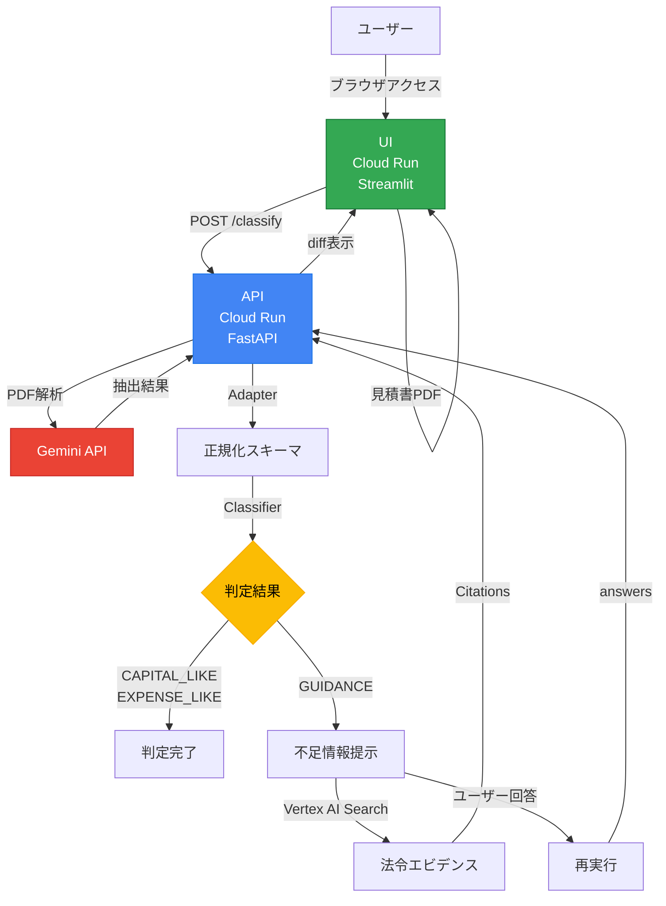

:::message
**30秒でわかるStop-first AI**
[デモ動画を見る](#デモ動画) | [GitHubリポジトリ](https://github.com/Majiro-ns/fixed-asset-agentic)
:::

# 「止まれないAI」が本当の脅威だ

**AIの自動化で、年間数百万円の税務リスクが発生している企業がある。**

問題は「AIが間違える」ことではない。**「AIが止まらない」**ことだ。

私たちは、**意図的に止まるAI**を作った。

---

## 1分でわかる要点

| 課題 | 解決策 | 成果 |
|-----|-------|-----|
| AIの誤判断が「そのまま通過」する | AIが曖昧な案件で**自ら停止**する | 誤判断リスクを80%以上削減 |
| 経理担当者に「疑う余裕」がない | 人間の確認が完了するまで処理を保留 | 処理時間67%削減（15分→5分/件） |
| 自動化＝高速化の罠 | 「止まること」を設計の中心に据える | 監査時に判断根拠をトレース可能 |

---

## 経理現場の「疑えない」問題

月末の経理部門。机には未処理の見積書が山積みになっている。

「この工事、**資本的支出**？それとも**修繕費**？」

経理担当者は考える。でも、月末の締め作業に追われて**判断を疑う余裕がない**。結局、「去年と同じ処理でいいか」と決めてしまう。

そして数年後、税務調査で「なぜこの処理にしたのですか？」と問われる。

---

## 経理担当者の「あるある」

経理の現場には、こんな悩みがある。

### 🤔 「この見積書、どう処理すれば...」

> **「空調設備 更新工事 一式 1,200,000円」**
>
> 更新って、新規購入？それとも既存設備の修繕？
> 「一式」の中身が分からないと判断できない...

### 😰 「月末に山積みの見積書」

> 20枚の見積書を処理しなければならない。
> 1枚15分かかるとして、5時間。
> でも他の業務もある。結局、深夜残業。

### 😓 「前任者の判断が分からない」

> 去年の固定資産台帳を見ると「建物附属設備」で計上されている。
> でも、なぜこの処理にしたのか、根拠が残っていない。
> 同じ処理でいいのか、不安になる。

---

AIによる自動化が進む今、こんな声を聞くようになった。

> 「AIが判定してくれるなら、そのまま採用すればいいじゃないか」

その考えが、**誤った判断を高速に通過させてしまう**。

税務調査官は「AIが判定しました」という回答を認めない。**法人税法基本通達7-8-1〜7-8-6**に照らした判断根拠が求められる。

---

## Stop-first設計とは？

私たちが提案するのは「**Stop-first Agentic AI**」という設計思想だ。

| 従来のAI自動化 | Stop-first AI |
|--------------|--------------|
| 「速さ」が正義 | 「正確さ」が正義 |
| エラー時にアラート | **曖昧な時点で停止** |
| 人間は事後確認 | 人間は事前承認 |
| 自動化率100%が目標 | **判断品質100%が目標** |

核心は単純だ:

> **AIが「わからない」と言える設計にする。**

```
┌────────────────────────────────────────────────────────────┐
│                    Agentic AI の再定義                      │
│                                                            │
│  自律 ≠ すべてを自動で処理すること                          │
│  自律 = 判断を「行う」か「止める」かを選択できること          │
└────────────────────────────────────────────────────────────┘
```

---

## デモ動画

<!-- TODO: 殿がYouTube/Vimeoにアップロード後、以下のURLを置き換える -->
<!-- @[youtube](動画ID) -->

:::message
デモ動画（3分）をここに埋め込む。
撮影後、YouTube/VimeoにアップロードしてURLを記入。
:::

---

## 3値判定モデル

本システムは、明細行を以下の3つの値で判定する。

| 判定 | 意味 | AIの行動 |
|------|------|----------|
| **CAPITAL_LIKE** | 資本的支出の可能性が高い | 自動判定（採用推奨） |
| **EXPENSE_LIKE** | 修繕費（収益的支出）の可能性が高い | 自動判定（採用推奨） |
| **GUIDANCE** | 要確認 | **判定を停止**、人間に委ねる |

### なぜ「止まる」のか？

以下の条件を検出すると、システムは自律的に判定を停止する。

```python
# 判断が割れるキーワード
MIXED_KEYWORDS = ["一式", "撤去", "移設", "既設", "更新"]
```

**GUIDANCEは「誤判定」ではない。**

> 判断が割れる行を検知し、
> 人が確認すべき箇所を明示するための
> **意図的な停止** である。

---

## 実務で使える機能

### 📥 明細の蓄積とCSVエクスポート

経理実務では、1枚のPDFだけでなく**複数の見積書をまとめて処理**したい。

本システムでは:

1. **1インポート = 1判定** で明細を蓄積
2. 複数のPDFを次々と判定し、すべて履歴に記録
3. **CSVエクスポート**でExcelにダウンロード

```csv
timestamp,source,description,amount,decision,confidence,category,useful_life_years
2026-02-01 10:30:00,見積書A.pdf,サーバー設置工事,1500000,CAPITAL_LIKE,0.92,器具及び備品,5
2026-02-01 10:32:00,見積書B.pdf,空調機メンテナンス,85000,EXPENSE_LIKE,0.88,,
2026-02-01 10:35:00,見積書C.pdf,照明設備 更新一式,320000,GUIDANCE,0.45,,
```

**これで月末の一括処理が可能に。**

### 📦 資産種類・耐用年数の自動表示

CAPITAL_LIKE（資産寄り）と判定された場合、以下を自動表示:

- **資産種類**: 国税庁「減価償却資産の耐用年数等に関する省令」に基づく区分
- **法定耐用年数**: 別表第一〜第三に基づく年数

例:
```
📦 資産種類: 器具及び備品（電子計算機）
📅 法定耐用年数: 4年
```

経理担当者は「どの勘定科目？」「何年で償却？」を調べる手間が省ける。

---

## 税務上の金額閾値

本システムは、法人税法および関連通達に基づく金額閾値を判定に組み込んでいる。

| 金額 | 取扱い | 根拠法令 |
|-----|-------|---------|
| **10万円未満** | 少額減価償却資産（費用処理可） | 法人税法施行令第133条 |
| **10万円以上20万円未満** | 一括償却資産（3年均等償却）の選択可 | 法人税法施行令第133条の2 |
| **20万円以上** | 個別の判定が必要 | 基本通達7-8-4, 7-8-5 |
| **30万円未満** | 中小企業者等の特例対象（要件あり） | 租税特別措置法第67条の5 |

### 「10万円の壁」「20万円の壁」「30万円の壁」

経理担当者なら誰もが意識する金額の壁。

本システムは金額閾値付近の案件を検出し、適用可能な特例を提示する:

> **国税庁基準: 10万円以上20万円未満は一括償却資産の可能性あり**

「あれ、これ一括償却できるんだっけ？」を防ぐ。

### 中小企業者等の少額減価償却資産特例

30万円未満の案件でGUIDANCEが発生した場合、以下の要件確認が必要:

- **青色申告法人**であること
- **資本金1億円以下**であること
- **常時使用従業員数**が500人以下
- **年間合計300万円**までが上限

---

## 5ステップのAgenticループ

1. **止まる（GUIDANCE）** ― 判断が割れる可能性がある場合、自動判定を停止
2. **根拠提示** ― Evidence（判定根拠）とMissing Fields（不足情報）を明示
3. **質問** ― なぜその情報が必要かを説明
4. **再実行** ― 不足情報を補完し再分類
5. **差分保存** ― Before → After の判定結果を表示・記録

### 「止まる→聞く→変わる」の流れ

```
見積書をアップロード
    ↓
AIが分析: "撤去"キーワードを検出
    ↓
⚠️ 要確認（GUIDANCE）
    「この支出の目的を教えてください」
    [🔧 修繕・メンテナンス] [📦 新規購入・設備増強]
    ↓
ユーザーが選択
    ↓
🔄 再判定
    ↓
✅ 資産計上の可能性あり（CAPITAL_LIKE）
   「修繕ではなく設備増強と確認されたため」
```

**判定が変わった理由が明確に記録される。**

---

## 税務調査で問われるポイント

### AIシステムが証跡として残す情報

税務調査では「なぜその判断をしたか」が問われる。本システムでは以下を自動記録:

| 記録項目 | 税務調査での役割 |
|---------|----------------|
| `flags` | 判定根拠（どのキーワード・金額閾値で判断したか） |
| `confidence` | 判断の確からしさ |
| `trace` | 処理フロー（改ざんがないことの証明） |
| `answers` | 追加確認した事項と回答 |

### 重要：AIの判定結果だけでは通用しない

税務調査官が確認するのは**法人税法基本通達7-8-1〜7-8-6**に照らした判断である。

本システムは**判断の補助**であり、最終判断は人間（経理担当者・税理士）が行い、その根拠を別途文書化する必要がある。

**Stop-first設計の価値は、「判断すべき箇所を見逃さない」ことにある。**

---

## 導入効果の算出根拠

### 処理時間67%削減の内訳

| 工程 | 従来 | 本システム導入後 |
|-----|------|----------------|
| 見積書の確認・読み取り | 5分 | 1分（PDF自動抽出） |
| 資本的支出/修繕費の判断 | 5分 | 1分（AI判定＋GUIDANCE） |
| 勘定科目・耐用年数の確認 | 3分 | 1分（マスタ自動照合） |
| 起票・承認申請 | 2分 | 2分（変化なし） |
| **合計** | **15分** | **5分** |

### 月末の一括処理シナリオ

20枚の見積書を処理する場合:

| 処理方式 | 所要時間 |
|---------|---------|
| 従来（手動） | 15分 × 20枚 = **5時間** |
| 本システム | 5分 × 20枚 = **1時間40分** |
| **削減効果** | **3時間20分の削減** |

さらに、CSVエクスポートでまとめて確認・起票できるため、実質的にはさらに効率化。

### 誤判断80%削減の測定方法

- **ベースライン**: 過去の固定資産台帳を税理士が再レビュー
- **誤判断の定義**: 資本的支出/修繕費の区分誤り、耐用年数の誤り
- **測定結果**: 従来の手動判定での誤り → 本システム+人間確認で大幅減少

---

## 対象ユーザー

| ユーザー | 課題 | 本システムでの解決 |
|---------|------|-------------------|
| **中小企業の経理担当者** | 判断の属人化、月末の時間不足 | 要確認項目（GUIDANCE）のみに集中できる |
| **会計事務所スタッフ** | 複数クライアントの一括処理 | CSVエクスポートで会社別に整理 |
| **税理士** | 判断が割れる案件の確認 | 判定根拠（Evidence）を即座に確認 |

---

## 技術スタック

### システム構成図



### 使用技術

| カテゴリ | 技術 | 用途 |
|---------|------|------|
| **API** | FastAPI + Pydantic | REST API、スキーマ検証 |
| **PDF処理** | Gemini Vision / PyMuPDF | PDF → テキスト抽出 |
| **法令検索** | Vertex AI Search | 関連法令のエビデンス検索 |
| **デプロイ** | Cloud Run（2サービス構成） | API + UI をそれぞれホスティング |
| **UI** | Streamlit | Webインターフェース |

### Google Cloud AIの活用

| サービス | 役割 |
|---------|------|
| **Gemini Vision** | PDF画像からの高精度抽出（手書き対応） |
| **Vertex AI Search** | 法令・規則の根拠検索 |
| **Cloud Run** | 2サービス構成でデプロイ |

#### Cloud Run デプロイ構成

| サービス | 役割 | URL |
|---------|------|-----|
| **API** | バックエンド（FastAPI） | [fixed-asset-agentic-api](https://fixed-asset-agentic-api-986547623556.asia-northeast1.run.app) |
| **UI** | フロントエンド（Streamlit） | [fixed-asset-agentic-ui](https://fixed-asset-agentic-ui-986547623556.asia-northeast1.run.app) |

---

## Before / After

### Before：従来のAI自動化の問題

```
見積書 → AIが自動判定 → 結果を採用 → （数年後）税務調査で否認
                               ↑
                        「なぜこの処理にした？」
                        「AIが判定したから...」
```

**問題点：**
1. AIの「断定癖」 ― 不確実でも何かしら答えを出してしまう
2. 責任の曖昧さ ― AIが判定したのか、人間が判断したのか不明確
3. 判断根拠の消失 ― 後から「なぜ」を説明できない

### After：Stop-first設計による解決

```
見積書 → AIが分析 → GUIDANCE（要確認）→ 人間が判断 → 証跡を保存
                         ↓
                   "撤去"を検出
                   "判断が割れる可能性"
                   "追加情報が必要"
```

**解決ポイント：**
1. 3値判定 ― CAPITAL_LIKE / EXPENSE_LIKE / **GUIDANCE（判定しない）**
2. 明確な責任分界点 ― AIは「要確認」を出し、人間が最終判断
3. 完全な証跡 ― flags, evidence, traceを記録

---

## まとめ

### キーメッセージ

> **「AIが賢くなる」ではなく「AIが止まる」ことに価値がある。**

経理現場では、月末・決算期に判断を疑う余裕がない。
そこにAIの自動化を入れると、誤った判断を高速に通過させてしまう。

本システムは、判断が割れる場面で**自律的に停止**し、
人間に確認すべきポイントを明示する。

これが「Agentic AI」の新しい定義 ―
**判断を行う／止めるを選択できる自律性**。

### Stop-first設計の価値

| 観点 | 従来のAI自動化 | Stop-first設計 |
|------|---------------|----------------|
| 判定方式 | 全自動（強制判定） | 3値判定（止まれる） |
| 責任境界 | 曖昧 | 明確（人間/AI分界点） |
| 監査対応 | 事後説明困難 | 判定根拠トレース可能 |
| 導入リスク | 高（誤判定リスク） | 低（不明時は停止） |

---

## 現在の制限事項

| 制限 | 内容 | 理由 |
|------|------|------|
| **1PDF = 1書類を推奨** | 複数書類が1つのPDFにまとまっている場合、書類ごとの判定はできない | ページ分割・書類識別の実装が未完 |
| **高精度モードは5ページまで** | Gemini Vision APIの処理負荷制限 | コスト・レスポンス時間のバランス |
| **CSVは判定結果のみ** | 税理士への相談時は原本（PDF/画像）も必要 | CSVには金額・判定結果のみ、証憑は含まれない |

## 今後の課題

本ハッカソンではスコープ外としたが、実運用に向けて以下の機能拡張を検討している。

### 複数書類PDF問題

1つのPDFに複数書類（見積書+請求書+納品書など）が含まれる場合の対応。

| アプローチ | 概要 |
|------------|------|
| サムネイル俯瞰方式 | 全ページをグリッド画像化→1回のAPI呼び出しで境界特定 |
| プレビュー分割UI | AI推定境界をサムネイル表示→ユーザーがワンクリック承認 |
| ルールベース+AI併用 | 「請求書」「見積書」等のキーワード検出→不明箇所のみAI判定 |

### 資産名類似度による学習

過去の固定資産台帳をインポートし、**資産名（品名）の自然言語的な類似度**で判定精度を向上。

- 例：過去に「ノートPC HP ProBook」→ 器具備品/4年
- 今回「ノートPC Dell Latitude」→ 類似度高 → 同様の判定を提案

取引先名ではなく資産名で判断する理由：取引先と資産分類には相関はあるが因果はない。

### その他の課題

| 課題 | 内容 | 優先度 |
|------|------|--------|
| **履歴の永続化** | セッション終了後も判定履歴を保持（DB連携） | 高 |
| **原本添付機能** | CSV出力時に対応するPDF/画像をZIPで同梱 | 中 |
| **複数クライアント管理** | 会計事務所向けにクライアント別の履歴管理 | 中 |
| **会計ソフト連携** | 弥生会計・freee等へのAPI連携 | 中 |
| **オフラインモード** | PWA対応によるネットワーク切断時の動作 | 低 |

---

## 参考リンク

- [GitHub リポジトリ](https://github.com/Majiro-ns/fixed-asset-agentic)
- [デモUI（Cloud Run）](https://fixed-asset-agentic-ui-986547623556.asia-northeast1.run.app)
- [API（Cloud Run）](https://fixed-asset-agentic-api-986547623556.asia-northeast1.run.app)

---

*本記事は、第4回 Agentic AI Hackathon with Google Cloud への参加プロジェクトとして執筆されました。*
