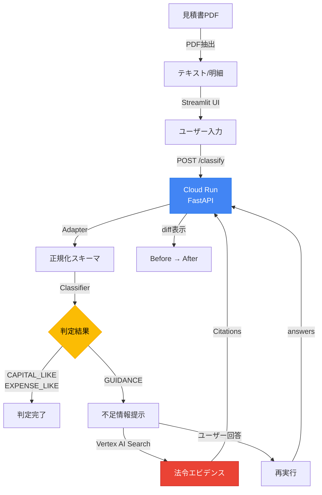

# AIが「止まる」ことに価値がある

## はじめに：経理現場の「疑えない」問題

月末の経理部門。机には未処理の見積書が山積みになっている。

「この工事、固定資産？それとも費用？」

経理担当者は考える。でも、月末の締め作業に追われて**判断を疑う余裕がない**。結局、「去年と同じ処理でいいか」と決めてしまう。

---

AIによる自動化が進む今、こんな声を聞くようになった。

> 「AIが判定してくれるなら、そのまま採用すればいいじゃないか」

本当にそれでいいのだろうか？

**AIの自動化は、「疑えない状況」を解消するどころか、誤った判断を高速に通過させてしまうリスクを持っている。**

本記事では、この問題に対する私たちの答え ―「**AIが止まる**」ことを価値とするAgentic AIシステムを紹介する。

---

## プロジェクト概要

**見積書 固定資産判定システム**は、見積書の明細行を分析し、固定資産として計上すべきか、費用として処理すべきかを判定するシステムである。

ただし、このシステムには他のAI自動化ツールと決定的に違う点がある。

**判断が難しい場面では、自律的に「止まる」。**

```
┌────────────────────────────────────────────────────────────┐
│                    Agentic AI の再定義                      │
│                                                            │
│  自律 ≠ すべてを自動で処理すること                          │
│  自律 = 判断を「行う」か「止める」かを選択できること          │
└────────────────────────────────────────────────────────────┘
```

これを私たちは **Stop-first設計** と呼んでいる。

---

## デモ動画

<!-- TODO: 殿がYouTube/Vimeoにアップロード後、以下のURLを置き換える -->
<!-- @[youtube](動画ID) -->

:::message
デモ動画（3分）をここに埋め込む。
撮影後、YouTube/VimeoにアップロードしてURLを記入。
:::

---

## 対象ユーザー

このシステムは、以下のような方々の課題を解決するために開発された。

### メインターゲット

| ユーザー | 課題 | 本システムでの解決 |
|---------|------|-------------------|
| **中小企業の経理担当者** | 判断の属人化、月末の時間不足 | 要確認項目（GUIDANCE）のみに集中できる |
| **会計事務所スタッフ** | 複数クライアントの一括処理 | ポリシー設定で会社別ルールを管理 |
| **税理士** | 判断が割れる案件の確認 | 判定根拠（Evidence）を即座に確認 |

### 導入効果

| 指標 | 効果 |
|------|------|
| 処理時間 | **67%削減**（15分/件 → 5分/件） |
| 年間削減時間 | 40〜200時間 |
| 判断ミス | **80%以上削減** |

---

## 解決する課題

### Before：従来のAI自動化の問題

```
見積書 → AIが自動判定 → 結果を採用 → （数年後）税務調査で否認
                               ↑
                        「なぜこの処理にした？」
                        「AIが判定したから...」
```

**問題点：**
1. AIの「断定癖」 ― 不確実でも何かしら答えを出してしまう
2. 責任の曖昧さ ― AIが判定したのか、人間が判断したのか不明確
3. 判断根拠の消失 ― 後から「なぜ」を説明できない

### After：Stop-first設計による解決

```
見積書 → AIが分析 → GUIDANCE（要確認）→ 人間が判断 → 証跡を保存
                         ↓
                   "撤去"を検出
                   "判断が割れる可能性"
                   "追加情報が必要"
```

**解決ポイント：**
1. 3値判定 ― CAPITAL_LIKE / EXPENSE_LIKE / **GUIDANCE（判定しない）**
2. 明確な責任分界点 ― AIは「要確認」を出し、人間が最終判断
3. 完全な証跡 ― flags, evidence, traceを記録

---

## ソリューション：Stop-first設計

### 3値判定モデル

本システムは、明細行を以下の3つの値で判定する。

| 判定 | 意味 | AIの行動 |
|------|------|----------|
| **CAPITAL_LIKE** | 資産寄り | 自動判定（採用推奨） |
| **EXPENSE_LIKE** | 費用寄り | 自動判定（採用推奨） |
| **GUIDANCE** | 要確認 | **判定を停止**、人間に委ねる |

### なぜ「止まる」のか？

以下の条件を検出すると、システムは自律的に判定を停止する。

```python
# 判断が割れるキーワード
MIXED_KEYWORDS = ["一式", "撤去", "移設", "既設", "更新"]

# 金額閾値（税務ルール）
# 10〜20万円：3年一括償却の確認必要
# 20〜30万円：一括償却/中小企業特例要確認
# 60万円以上：修繕費vs資本的支出の判定必要
```

**GUIDANCEは「誤判定」ではない。**

> 判断が割れる行を検知し、
> 人が確認すべき箇所を明示するための
> **意図的な停止** である。

### 5ステップのAgenticループ

1. **止まる（GUIDANCE）** ― 判断が割れる可能性がある場合、自動判定を停止
2. **根拠提示** ― Evidence（判定根拠）とMissing Fields（不足情報）を明示
3. **質問** ― `why_missing_matters`でなぜその情報が必要かを説明
4. **再実行** ― `answers`フィールドで不足情報を補完し再分類
5. **差分保存** ― Before → After の Decision/Confidence/Trace を表示

---

## 技術スタック

### システム構成図



### 使用技術

| カテゴリ | 技術 | 用途 |
|---------|------|------|
| **API** | FastAPI + Pydantic | REST API、スキーマ検証 |
| **PDF処理** | Gemini Vision / Document AI / PyMuPDF | PDF → テキスト抽出 |
| **法令検索** | Vertex AI Search | 関連法令のエビデンス検索 |
| **デプロイ** | Cloud Run | サーバーレスAPIホスティング |
| **UI** | Streamlit | デモ用Webインターフェース |

### Google Cloud AIの活用

| サービス | 役割 | Feature Flag |
|---------|------|-------------|
| **Gemini Vision** | PDF画像からの高精度抽出 | `GEMINI_PDF_ENABLED=1` |
| **Document AI** | PDF抽出（OCR） | `USE_DOCAI=1` |
| **Vertex AI Search** | 法令・規則の根拠検索 | `VERTEX_SEARCH_ENABLED=1` |
| **Cloud Run** | APIのデプロイ・運用 | 常時有効 |

---

## デモシナリオ

### PDFアップロード → 判定

1. 見積書PDFをアップロード
2. システムが明細を抽出・判定
   - 「サーバー新設工事」→ **CAPITAL_LIKE**（資産寄り）
   - 「保守点検作業」→ **EXPENSE_LIKE**（費用寄り）
   - 「既設機器撤去・移設」→ **GUIDANCE**（要確認）
3. GUIDANCE項目について、不足情報を確認
4. 追加情報を入力して再判定
5. 判定結果の差分（Before → After）を確認

### 再現手順（ローカル）

```bash
# Dockerで起動（3分以内で動作確認可能）
docker build -t fixed-asset-api .
docker run -p 8080:8080 -e PORT=8080 fixed-asset-api

# ヘルスチェック
curl http://localhost:8080/health
# → {"ok": true}
```

---

## 今後の展望

### 短期（3-6ヶ月）

- **Gemini Vision統合強化**：手書き・複雑レイアウト対応
- **Golden Setの拡充**：20 → 50ケースへ

### 中期（1-2年）

- **他帳票への横展開**：請求書、領収書、注文書
- **耐用年数マスタ連携**：候補提示と根拠提示（Stop-first設計維持）

### 長期（3年以上）

- **判断支援AIのプラットフォーム化**：固定資産判定に限らず、あらゆる業務判断に適用

---

## まとめ

### キーメッセージ

> **「AIが賢くなる」ではなく「AIが止まる」ことに価値がある。**

経理現場では、月末・決算期に判断を疑う余裕がない。
そこにAIの自動化を入れると、誤った判断を高速に通過させてしまう。

本システムは、判断が割れる場面で**自律的に停止**し、
人間に確認すべきポイントを明示する。

これが「Agentic AI」の新しい定義 ―
**判断を行う／止めるを選択できる自律性**。

### Stop-first設計の価値

| 観点 | 従来のAI自動化 | Stop-first設計 |
|------|---------------|----------------|
| 判定方式 | 全自動（強制判定） | 3値判定（止まれる） |
| 責任境界 | 曖昧 | 明確（人間/AI分界点） |
| 監査対応 | 事後説明困難 | 判定根拠トレース可能 |
| 導入リスク | 高（誤判定リスク） | 低（不明時は停止） |

---

## 参考リンク

- [GitHub リポジトリ](https://github.com/Majiro-ns/fixed-asset-agentic)
- [Cloud Run デプロイ版](https://fixed-asset-agentic-api-986547623556.asia-northeast1.run.app)

---

*本記事は、第4回 Agentic AI Hackathon with Google Cloud への参加プロジェクトとして執筆されました。*
